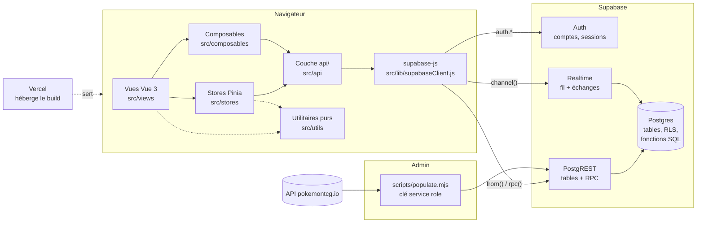

# 1. Vue d'ensemble

[← Sommaire](README.md) · Suivant : [Front-end →](02-front-end.md)

## Ce qu'est l'application

PokéBooster est une application web (SPA) où un joueur connecté ouvre des
boosters Pokémon et se construit une collection. Il y a deux **modes de
jeu**, avec chacun sa collection :

- **Illimité** : on ouvre autant de boosters qu'on veut, gratuitement.
- **Défi** : chaque booster coûte 100 pièces. On gagne des pièces avec une
  récompense quotidienne, des missions, le recyclage des doublons et des
  mini-jeux. On peut aussi fabriquer des cartes et échanger avec d'autres
  joueurs.

Autour des deux modes : profils publics, fil des gros tirages en direct,
classements, ~240 succès par mode, liste de souhaits, historique des
ouvertures, application installable (PWA), français/anglais, thème clair
ou sombre.

## Les briques



| Brique | Rôle | Où |
| --- | --- | --- |
| **Vite + Vue 3** | Build et interface. Composition API + `<script setup>` partout | `src/` |
| **Vue Router** | Une route par page, garde d'authentification, pages chargées à la demande | [src/router/](../../src/router/) |
| **Pinia** | État partagé et chargements (collection, portefeuille du Défi, échanges…) | [src/stores/](../../src/stores/) |
| **vue-i18n** | Tous les textes, en `en` et `fr` | [src/i18n/locales/](../../src/i18n/locales/) |
| **Bootstrap 5** | Base CSS, recouverte par le design system « Holo Collector » | [src/assets/styles/global.css](../../src/assets/styles/global.css) |
| **Supabase** | **Tout le back-end** : comptes (Auth), base Postgres, API REST générée, temps réel | [supabase/migrations/](../../supabase/migrations/) |
| **Vercel** | Héberge le build statique | [vercel.json](../../vercel.json) |
| **pokemontcg.io** | Source des sets, cartes, images et prix (Cardmarket, sinon TCGplayer converti en €), importés par un script d'admin | [scripts/populate.mjs](../../scripts/populate.mjs) |

Il n'y a **pas de serveur applicatif** à nous. Le navigateur parle
directement à Supabase. La logique qui doit rester fiable (tirer un pack,
dépenser des pièces, échanger des cartes) est écrite **en SQL**, dans des
fonctions Postgres que le navigateur appelle (les « RPC »).

## Qui fait quoi : navigateur ou serveur

La règle de partage est simple : **tout ce que les autres joueurs peuvent
voir, ou qui a de la valeur dans le jeu, est calculé et écrit par le
serveur**. Le navigateur ne fait qu'afficher et demander.

| Le serveur (fonctions SQL) décide | Le navigateur calcule seul |
| --- | --- |
| Les 10 cartes d'un booster (taux de tirage réels) | L'ordre de révélation (communes d'abord, meilleure carte à la fin) |
| L'ajout des cartes à la collection | Les statistiques affichées (total, valeur, raretés, niveau) |
| Le solde de pièces, les récompenses, les missions | Les succès (~240 définitions en JS) |
| Les échanges (vérification + transfert atomique) | Les filtres, tris, recherches |
| Les réponses du mini-jeu et ses gains | Les animations, sons, vibrations |
| Le fil public et les classements | Le thème, la langue, les réglages |

Deux exceptions assumées, documentées dans le code :

- **Les données purement personnelles** sont écrites directement par le
  client : liste de souhaits (`wishlist`), cartes gardées hors échanges
  (`trade_locks`), et certaines colonnes de son propre profil (pseudo,
  public/privé, carte vitrine, accepte les échanges).
- **Les succès débloqués** sont déclarés par le client
  (`record_achievements`), car le serveur ne peut pas recalculer ~240
  définitions écrites en JS. Ça ne sert qu'à afficher un pourcentage
  anonyme (« 12 % des joueurs »), que rien ne classe ni ne récompense.

## Le modèle de sécurité en 4 points

1. **Authentification = Supabase Auth, uniquement.** Pas de table
   d'utilisateurs maison ni de mot de passe comparé dans notre code. La
   session vit dans supabase-js ; chaque requête porte un jeton (JWT) d'où
   Postgres tire `auth.uid()`.
2. **La clé publique (anon) n'est pas un secret.** Elle est dans le
   bundle (`VITE_SUPABASE_ANON_KEY`). Ce qui protège les données, c'est la
   **Row Level Security (RLS)** : chaque table a des règles du type « un
   joueur ne lit que ses lignes » (`auth.uid() = user_id`).
3. **Les écritures sensibles passent par des fonctions `SECURITY DEFINER`.**
   Les tables de jeu (`collections`, `booster_openings`, portefeuilles…)
   n'ont **aucune** règle d'écriture pour les clients. Les fonctions SQL
   s'exécutent avec les droits de leur propriétaire, mais ne touchent que
   les lignes de `auth.uid()`, et sont limitées en fréquence (60 packs par
   minute, 20 parties de mini-jeu par minute).
4. **La clé service role ne quitte jamais l'admin.** Elle contourne la RLS
   et ne sert qu'au script d'import (`scripts/.env.local`, non versionné) et
   au workflow GitHub hebdomadaire (secrets du dépôt). Rien sous `src/`
   ne l'importe.

## Les deux modes, techniquement

Les deux modes partagent le même code, paramétré par un `mode` :

- **En base** : `collections.mode` et `booster_openings.mode` valent
  `'unlimited'` ou `'challenge'`. La clé de `collections` est
  `(user_id, mode, card_id)` : une même carte peut être possédée une fois
  par mode.
- **Dans le routeur** : les pages du Défi sont les mêmes composants avec
  une prop `mode: 'challenge'` (`/challenge/boosters` réutilise
  `BoosterView.vue`). Voir [Front-end > Routes](02-front-end.md#2-routes-et-navigation).
- **Dans les stores** : une collection par mode
  (`useModeCollectionStore(mode)`).

Le Défi ajoute ses propres tables (portefeuille, journal des pièces,
échanges, parties de mini-jeu) décrites dans
[Base de données](03-base-de-donnees.md#mode-défi).

## Arborescence

```
src/
  main.js, App.vue       démarrage : pinia, router, i18n, thème, PWA
  router/                routes, garde d'auth, modes (modes.js)
  stores/                état Pinia (un fichier par domaine)
  api/                   appels supabase-js (un fichier par domaine)
  views/                 une vue par route
  components/            composants partagés (booster, cartes, header…)
  composables/           logique réutilisable liée à l'i18n ou aux stores
  utils/                 fonctions pures + leurs tests *.test.js
  lib/                   client Supabase, sons, image de partage, PWA, versions
  i18n/locales/          en.json, fr.json
  assets/styles/         global.css (tokens --pb-*, design system)
public/                  sw.js (service worker), manifest, icônes
supabase/migrations/     SQL à exécuter dans l'éditeur Supabase, dans l'ordre
supabase/tests/          tests des migrations dans PGlite
scripts/populate.mjs     import pokemontcg.io (admin, jamais dans le bundle)
e2e/                     tests Playwright + faux Supabase (support/supabase.js)
.github/workflows/       CI + synchro hebdomadaire des cartes
docs/                    cette doc + checklist de test manuel
```
