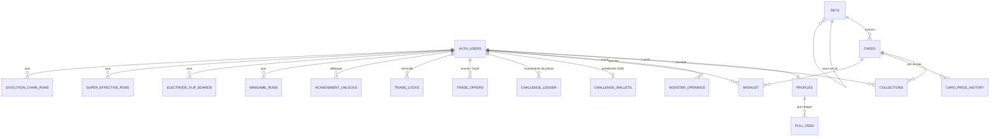

# 3. Base de données

[← Front-end](02-front-end.md) · [Sommaire](README.md) · Suivant : [Référence API →](04-reference-api.md)

Toute la base est définie par les fichiers de
[supabase/migrations/](../../supabase/migrations/), exécutés dans l'ordre
dans l'éditeur SQL de Supabase. Cette page décrit **l'état final** après
toutes les migrations ; l'[historique](#historique-des-migrations) en bas
dit quelle migration a apporté quoi.

## Schéma

## Lire les règles d'accès

Chaque table a la **RLS activée**. Dans les tableaux ci-dessous :

- **Lecture** : qui peut faire un `select` depuis le navigateur ;
- **Écriture client** : ce que le navigateur peut écrire directement.
  « Aucune » veut dire que seules les fonctions SQL (`SECURITY DEFINER`) ou
  la clé service role écrivent dans la table.

`anon` = visiteur non connecté, `authenticated` = joueur connecté,
`auth.uid()` = l'identifiant du joueur qui fait la requête.

---

## Catalogue de cartes

Remplies par [scripts/populate.mjs](../../scripts/populate.mjs) (clé
service role) depuis pokemontcg.io. Actuellement 176 sets et 20 670 cartes.

### `sets`

| Colonne | Type | Sens |
| --- | --- | --- |
| `id` | text, PK | Identifiant pokemontcg.io (`sv3pt5`, `base1`…) |
| `name` | text | Nom du set |
| `release_date` | date | Date de sortie (sert aux tris et groupes par année) |
| `printed_total`, `total` | int | Nombre de cartes imprimé / réel |
| `series` | text | Ère du JCC donnée par pokemontcg.io (`Base`, `Neo`, `EX`… `Scarlet & Violet`, `Mega Evolution`), remplie par l'import depuis 0024 ; format « Une ère » des combats PvP |
| `logo_url`, `symbol_url` | text | Images du set. Depuis 2026, les nouveaux sets sont sur `images.scrydex.com` avec un autre schéma d'URL : on stocke ce que l'API donne au lieu de deviner l'URL à partir de l'id |
| `parent_set_id` | text → `sets.id` | Renseigné pour un **sous-set** (Trainer Gallery, Galarian Gallery, Shiny Vault, Classic Collection) : le set dont les boosters contiennent ses cartes |
| `subset_rate` | numeric 0–1 | Chance qu'un booster du parent contienne une carte de ce sous-set (TG 25 %, Shiny Vault 30 %, les autres 33 %) |
| `tcgdex_id` | text | Le set TCGdex aux mêmes cartes (`sv03.5` pour `sv3pt5`), trouvé par l'import `fr` (0029) en comparant numéros et noms anglais ; `''` = aucun (Celebrations Classic Collection…), `null` = pas encore cherché |
| `name_fr` | text | Nom français du set (TCGdex, 0029 ; « Set de Base ») |

Lecture : tout le monde. Écriture client : aucune.

### `cards`

| Colonne | Type | Sens |
| --- | --- | --- |
| `id` | text, PK | `sv3pt5-199`… |
| `name`, `rarity` | text | Nom, rareté brute (~45 libellés selon les époques) |
| `rarity_bucket` | text, **générée** | Une des 6 raretés du jeu, calculée par `rarity_bucket(rarity)` (voir plus bas) |
| `value` | numeric | Prix en € : moyenne de vente Cardmarket, sinon prix TCGplayer converti depuis l'USD (sets récents sans Cardmarket, `cardPriceEur`), 0 si inconnu |
| `image_url`, `image_small` | text | Grande et petite image |
| `artist`, `supertype`, `subtypes`, `hp`, `types` | … | Métadonnées de la carte (supertype = `Pokémon`, `Trainer`, `Energy`) |
| `national_pokedex_number` | int | Numéro du Pokédex national (onglet Pokédex, succès) |
| `weaknesses` | text[] | Types de faiblesse imprimés sur la carte (`{Fire}`), remplis par l'import depuis 0015 ; sert à « Super efficace ! ». `null` tant que l'import n'est pas repassé |
| `evolves_from` | text | Nom du stade précédent imprimé sur la carte (`Charmeleon` pour Dracaufeu), rempli par l'import depuis 0018 ; sert à « Chaîne d'évolution » (lignée = Niveau 2 → le Niveau 1 qu'il nomme → la carte de base que celui-ci nomme). Index sur `cards.name` et `cards.evolves_from` (0019) pour suivre les lignées |
| `attacks` | jsonb | Attaques imprimées `[{ name, damage, cost, text, base, fx, coins, partial }]` : `cost` = nombre d'énergies (depuis 0025 ; une attaque sans `cost` est ignorée par `pvp_card()`, jamais gratuite), `damage` tel quel (`"30"`, `"30+"`, `"20×"`, `""` = effet seul), et depuis 0029 le texte imprimé (anglais) et ce que les combats en jouent (`src/utils/attackEffects.js` à l'import : dégâts de base, effets, pièces, `partial` = une partie du texte n'est pas jouée). Remplies par l'import depuis 0024 |
| `retreat_cost` | int | Coût de Retraite en Énergies (0029) |
| `abilities` | jsonb | Talents imprimés `[{ name, text, type }]` (0029 ; montrés en combat, pas encore joués) |
| `name_fr`, `image_fr` | text | Nom et image français (TCGdex, 0029) : `image_fr` est l'URL de base, le client ajoute `/low.webp` ou `/high.webp`. `null` pour une carte jamais sortie en français (Set de Base 2, Gym…) : le site l'affiche en anglais |
| `attacks_fr`, `abilities_fr` | jsonb | Noms et textes français des attaques et talents `[{ name, effect }]`, dans le même ordre que `attacks` / `abilities` (TCGdex, 0029) |
| `trainer` | jsonb | Dresseurs (0032) : `{ kind (item / supporter / tool / stadium / other), fx, coins, playable, text, ace_spec }`, lu par `trainerEffects.js` à l'import |
| `effect_fr` | text | Texte français d'un Dresseur (TCGdex, 0032) |
| `resistances` | text[] | Types de résistance imprimés (`{Fighting}`), depuis 0024 ; −30 en combat PvP |
| `set_id` | text → `sets.id` | Set de la carte |

Index : `(set_id)`, `(set_id, rarity_bucket)` (tirage par rareté).
Lecture : tout le monde. Écriture client : aucune.

### `card_price_history`

Un relevé de prix par carte et par jour d'import (`card_id`, `recorded_on`,
`value`), écrit à chaque `populate:cards`. Alimente la courbe de prix de
la fiche carte. Lecture : tout le monde. Écriture client : aucune.

### Les 6 raretés (`rarity_bucket`)

Les libellés bruts ont changé à chaque époque ; le jeu les regroupe en 6
niveaux. **Miroir** : `rarity_bucket()` en SQL (migration 0003) et
`rarityBucket()` dans [src/utils/rarity.js](../../src/utils/rarity.js).

| Rareté | Contient |
| --- | --- |
| `common` | Common, Promo, sans rareté (énergies de base) |
| `uncommon` | Uncommon |
| `rare` | Rare |
| `holo` | Rare Holo, ex/EX/GX/V/VMAX/VSTAR, Double Rare, Radiant, ACE SPEC… (tout autre libellé contenant « rare » ou « holo ») |
| `ultra` | Ultra Rare, Illustration Rare, Trainer Gallery, Shiny… |
| `secret` | Special Illustration Rare, Hyper Rare, Secret, Rainbow |

Côté affichage, `rarityTier()` les regroupe en 3 niveaux visuels :
commune (common, uncommon), rare (rare, holo), **hit** (ultra, secret).

---

## Joueurs et collections

### `profiles`

Une ligne par compte, créée **par un trigger** à l'inscription
(`handle_new_user` sur `auth.users`) avec le pseudo choisi à l'inscription
(obligatoire dans le formulaire). Sans pseudo, c'était le début de
l'e-mail (« jean.dupont », visible de tous sur un profil public) ; depuis
0023 c'est `Trainer-1234`. Si le pseudo est pris, `unique_username()`
ajoute un suffixe numérique.

| Colonne | Type | Sens |
| --- | --- | --- |
| `id` | uuid, PK → `auth.users` | Le compte |
| `username` | text | Unique **sans tenir compte de la casse** (index sur `lower(username)`), 2 à 24 caractères, sans espaces autour ni caractères de contrôle |
| `is_public` | bool, défaut vrai | Profil visible des autres, présent dans le fil et les classements |
| `showcase_card_id` | text → `cards` | Carte vitrine ; un trigger vérifie qu'elle est possédée en Illimité |
| `accepts_trades` | bool, défaut vrai | Faux = personne ne peut lui proposer d'échange |
| `created_at`, `updated_at` | timestamptz | |

Lecture : les profils publics + le sien. Écriture client : **uniquement
son propre profil**, et **uniquement** les colonnes `username`,
`is_public`, `showcase_card_id`, `accepts_trades` (droits par colonne).

### `collections`

| Colonne | Type | Sens |
| --- | --- | --- |
| `user_id` | uuid → `auth.users` | Propriétaire |
| `mode` | text | `'unlimited'` ou `'challenge'` |
| `card_id` | text → `cards` | La carte |
| `quantity` | int > 0 | Nombre d'exemplaires |
| `acquired_at` | timestamptz | Première obtention |

Clé primaire : `(user_id, mode, card_id)`. Lecture : **ses propres lignes
uniquement**. Écriture client : **aucune**. Seuls l'ouverture de packs, le
recyclage, la fabrication et les échanges (fonctions SQL) la modifient,
toujours avec des `INSERT … ON CONFLICT DO UPDATE` atomiques. Les
collections des autres joueurs se lisent via `public_collection()` et
`challenge_collection_of()`, qui vérifient que le profil est public.

### `booster_openings`

Le journal de **chaque pack ouvert** (depuis la migration 0004 : les
packs Illimité plus anciens n'ont pas été enregistrés).

| Colonne | Sens |
| --- | --- |
| `id`, `user_id`, `mode`, `set_id`, `opened_at` | Qui, quel mode, quel set, quand |
| `card_ids` | Les 10 ids dans l'ordre du pack |
| `best_card_id` | Meilleure carte (rareté la plus haute, puis la plus chère) |
| `hits`, `secrets` | Nombre de cartes ultra+secret, et secret seules |
| `god_pack` | Pack divin du Défi |

Lecture : ses propres lignes. Écriture client : aucune. Sert à
l'historique, aux statistiques de succès, aux missions et au classement
« taux de hits ». La limite de fréquence (60 packs/minute) se compte aussi
ici.

### `wishlist`

`(user_id, card_id, created_at)`, clé `(user_id, card_id)`, `user_id` vaut
`auth.uid()` par défaut. Données personnelles : le joueur lit, ajoute et
retire **ses** lignes directement. Une carte tirée en Illimité en est
retirée automatiquement par le serveur.

### `pull_feed`

Fil public des **gros tirages** (ultra et secret) des profils publics ;
pour un set qui n'a aucune ultra ni secrète (Base, Jungle, Fossil, Neo,
Gym, DP…), ses holo (depuis 0016, voir `feed_buckets`). Table
dénormalisée pour s'afficher sans jointure : `user_id`, `username`,
`card_id`, `card_name`, `image_small`, `bucket`, `set_id`, `mode`,
`pulled_at`. Publié dans **Supabase Realtime** (fil en direct). Les lignes
de plus de 30 jours sont purgées de temps en temps (2 % des ouvertures).
Lecture : les lignes des profils publics. Écriture client : aucune.

---

## Mode Défi

### `challenge_wallets`

Une ligne par joueur, créée au premier appel d'une fonction du Défi avec
**1000 pièces de départ**.

| Colonne | Sens |
| --- | --- |
| `user_id` | PK |
| `coins` | Solde (≥ 0, contrainte) |
| `daily_streak`, `last_daily_on` | Série de récompenses quotidiennes et dernier jour réclamé |
| `created_at` | |

Lecture : la sienne. Écriture client : aucune. **Chaque fonction du Défi
commence par verrouiller cette ligne** (`lock_challenge_wallet`,
`SELECT … FOR UPDATE`) : c'est le verrou par joueur qui empêche deux
onglets de dépenser les mêmes pièces.

### `challenge_ledger`

Le journal de **chaque mouvement de pièces** : `kind` (`start`, `daily`,
`booster`, `recycle`, `craft`, `mission`, `minigame`, `electrode_flip`, `super_effective`, `evolution_chain`, `pvp_bot` (0027)), `amount` (+ gagné,
− dépensé), `card_id`, `quantity`, `mission`, `game_day`, `created_at`.

Un index unique `(user_id, mission, game_day) where kind = 'mission'`
garantit qu'une mission n'est réclamée qu'une fois par jour. Les missions
hebdomadaires sont datées du lundi de la semaine : le même index les rend
réclamables une fois par semaine. Lecture : le sien. Écriture client :
aucune.

**Jour de jeu = UTC** : `challenge_today()` renvoie la date UTC ; les
missions quotidiennes et la récompense changent à 00:00 UTC, les missions
hebdomadaires le lundi à 00:00 UTC (`challenge_week_start()`).

### `trade_offers`

| Colonne | Sens |
| --- | --- |
| `id`, `from_user`, `to_user` | Offre de `from_user` à `to_user` (jamais soi-même) |
| `offer_cards` | 1 à 5 ids donnés (un exemplaire chacun) |
| `request_cards` | 0 à 5 ids demandés (0 = cadeau) |
| `status` | `pending`, `accepted`, `declined`, `cancelled`, `failed`, `countered` (0021 : remplacée par une contre-offre) |
| `counter_of` | Offre à laquelle celle-ci répond (contre-offre, 0021), `null` sinon |
| `created_at`, `resolved_at` | Une offre en attente expire après 7 jours (`trade_ttl()`) |
| `answer_seen` | L'expéditeur a vu la fin de son offre (acceptée, refusée, échouée) ; `false` jusqu'à sa visite de la page des échanges (0017). Les offres déjà finies à l'ajout de la colonne comptent comme vues |

Lecture : les deux joueurs concernés. Écriture client : aucune. Publiée
dans Realtime (la RLS s'applique : chacun ne reçoit que ses offres).

### `trade_locks`

`(user_id, card_id)` : cartes du Défi que le joueur garde hors échanges.
Données personnelles, écrites par le joueur (lecture, ajout, suppression
de ses lignes).

### `minigame_runs`

Une ligne par partie de « Plus ou moins » : `paid` (payée ou non),
`streak`, `coins`, `left_card`, `right_card`, `shown_at` (quand la paire
a été tirée), `status` (`playing`, `lost`, `timeout`, `abandoned`),
`game_day`. Une seule partie `playing` par joueur (index unique).
**Aucun accès client**, même en lecture : les prix de la paire en cours ne
doivent pas fuiter.

### `electrode_flip_boards`

Une ligne par plateau d'« Électrode Shiny Flip » : `level` (1 à 5),
`tiles` (25 cases ligne par ligne, 0 = Électrode, sinon 1 à 3),
`flipped` (25 booléens), `flips` (cases à points retournées), `points`,
`coins` (pièces payées), `status` (`playing`, `won`, `lost`,
`cashed`), `next_level` (posé à la fin), `game_day`. Un seul plateau
`playing` par joueur (index unique). **Aucun accès client**, même en
lecture : le plateau ne doit pas fuiter.

### `super_effective_runs`

Une ligne par partie de « Super efficace ! » : `paid`, `streak`, `coins`,
`card_id` (la carte posée), `answer` (le bon type), `options` (les types
proposés, réponse comprise), `shown_at`, `status` (`playing`, `lost`,
`timeout`, `abandoned`), `game_day`. Une seule partie `playing` par
joueur (index unique). **Aucun accès client** : la réponse ne doit pas
fuiter.

### `evolution_chain_runs`

Une ligne par partie de « Chaîne d'évolution » : `paid`, `streak`,
`coins`, `chain` (les 2 ou 3 ids de la lignée posée, la carte de base en
premier), `cards` (les cartes montrées, lignée + intrus, mélangées),
`shown_at`, `status` (`playing`, `lost`, `timeout`, `abandoned`,
`stopped` depuis 0019),
`game_day`. Une seule partie `playing` par joueur (index unique).
**Aucun accès client** : l'ordre ne doit pas fuiter.

### `pvp_decks`, `pvp_ratings`, `pvp_battles` (0024 à 0032)

- `pvp_decks` : `(user_id, format, role)` → `card_ids` (20 ids depuis
  0030, un par exemplaire ; 5 avant, devenus invalides). Deux
  decks par format (`all`, `era:<série>`, `set:<id>`) depuis 0026 :
  `role` = `attack` (celui que je joue) ou `defense` (celui que le
  serveur joue quand on m'attaque). Sans deck de défense valide, le deck
  d'attaque défend. Les decks d'avant 0026 sont devenus des decks
  d'attaque. `energy` (0031, `text[]`) : 1 ou 2 types d'Énergie ;
  `null` = déduite des coûts de ses cartes (`pvp_deck_energy`).
- `pvp_ratings` : `(user_id, format)` → `elo` (1000 au départ), `wins`,
  `losses`, `draws` (en attaque), `def_wins`, `def_losses`, `def_draws`
  (en défense).
- `pvp_battles` : un combat : `attacker`, `defender`, `format`,
  `a_deck` / `d_deck` (instantanés des cartes, figés au départ), `a_hp`
  / `d_hp`, `a_energy` / `d_energy` (réserves d'énergie, 0025), `d_next` et
  `d_next_attack` (la prochaine carte du défenseur et son attaque, `null`
  = pas d'attaque, choisies **avant** que l'attaquant joue), `round`,
  `a_prizes` / `d_prizes` (récompenses prises, 0025 ; remplacent `a_kos` /
  `d_kos` de 0024), `log` (une entrée par
  manche), `status` (`playing`, `won`, `lost`, `draw`, `forfeit`, du point
  de vue de l'attaquant), `elo_change` (celui de l'attaquant, le défenseur
  bouge de l'opposé), `game_day`. Un seul combat `playing` par attaquant.
  Combat contre un bot (0027) : `defender` vide, `bot` (`easy`, `normal`,
  `hard`), `paid` (dans les 5 premiers combats contre les bots du jour),
  `coins` (pièces versées à la fin) ; une contrainte impose exactement un
  des deux (`defender` ou `bot`). Depuis 0030 (`engine` = 2), l'état
  complet est dans `game` (jsonb : `turn`, `phase`, `stage`, `current`,
  `first`, `level` de l'IA, `promote`, `winner`, et pour chaque camp `a` /
  `d` ses 20 cartes, son deck mélangé, sa main, sa défausse, son Actif et
  son Banc (`{ c, under, damage, energy, etypes, status, poisoned, burned,
  turn_in, lock_attack, no_retreat, reduce, prevent, smoke, weaken }`),
  ses points, et depuis 0031 (`engine` = 3) `energy_types`, `zone`
  (l'Énergie de ce tour) et `next`, depuis 0032 `supporter_used`,
  `no_trainers`, `boost` / `shield` / `retreat_less` (`{ n, turn }`), et
  pour chaque Pokémon son Outil `tool` (index de carte)) ; `log` garde les 300 derniers événements ; `a_hp` / `d_hp`
  / énergies / récompenses de l'ancien moteur ne servent plus. Les
  combats de l'ancien moteur en cours au passage de 0030 finissent en
  nul, sans Elo ni pièces ; ceux du moteur 2 en cours au passage de 0031
  aussi.

**Aucun accès client** sur les trois : les decks sont cachés, l'Elo est
écrit par le serveur.

---

## Succès

### `achievement_unlocks`

`(user_id, mode, achievement_id, unlocked_at)`, clé `(user_id, mode,
achievement_id)`. Les ids déclarés par le client via
`record_achievements()` (format vérifié : `^[A-Za-z0-9_]{1,48}$`, 500 au
maximum par appel). Sert à deux choses : un succès déjà enregistré **reste
débloqué** même si la collection rétrécit (recyclage, échanges), et au
calcul des taux (« 12 % des joueurs »). **Aucun accès client direct** :
seulement les fonctions.

---

## Fonctions internes

Ces fonctions ne sont **pas appelables** par les clients (droits retirés) ;
elles servent de briques aux RPC décrites dans la
[Référence API](04-reference-api.md).

| Fonction | Rôle |
| --- | --- |
| `rarity_bucket(rarity)` | Libellé brut → une des 6 raretés |
| `open_booster(set_id)` | Tire un pack de 10 cartes ([détail](05-parcours.md#le-tirage-côté-serveur-open_booster)) |
| `pick_booster_card(set, bucket, exclude)` | Une carte d'une rareté, sinon la rareté inférieure qui existe dans le set, sans doublon dans le pack |
| `pick_subset_card(subset, exclude)` | Une carte de sous-set : surtout holo, parfois ultra (36 %), rarement secret (4 %) |
| `save_booster_opening(user, mode, cards, god_pack)` | Ajoute les cartes à la collection, journalise le pack, retire de la liste de souhaits (Illimité), publie les hits dans le fil (raretés données par `feed_buckets`) |
| `feed_buckets(set_id)` | Raretés publiées dans le fil pour un pack de ce set : `{ultra,secret}`, plus `holo` si le set n'a ni ultra ni secrète (0016) |
| `check_booster_rate(user)` | Refuse au-delà de 60 packs par minute |
| `require_player()` | `auth.uid()` ou erreur `not_authenticated` |
| `lock_challenge_wallet(user)` | Crée le portefeuille si besoin (1000 pièces + ligne `start`), puis le verrouille |
| `challenge_missions(user)`, `challenge_weekly_missions(user)` | Missions du jour et de la semaine avec leur progression |
| `challenge_recycle_value(bucket)`, `challenge_craft_price(bucket)`, `challenge_daily_reward(streak)` | Barème du Défi (**miroir** : `src/utils/challenge.js`) |
| `owns_challenge_cards`, `move_challenge_cards`, `has_trade_lock`, `trade_ttl` | Vérifications et transfert des échanges |
| `minigame_rules`, `minigame_min_ratio`, `minigame_pair`, `minigame_card` | Règles et tirage des paires du mini-jeu |
| `super_effective_rules`, `super_effective_types`, `super_effective_option_count`, `super_effective_ready`, `super_effective_question`, `super_effective_card` | Règles, cartes jouables et tirage des questions de « Super efficace ! » (`card` = la carte sans sa faiblesse) |
| `evolution_chain_rules`, `evolution_chain_intruders`, `evolution_chain_ready`, `evolution_chain_line`, `evolution_chain_question`, `evolution_chain_cards` | Règles, lignées complètes et tirage des questions de « Chaîne d'évolution » (`line(2 ou 3)` = une lignée ou `null`, `cards` = nom + image, sans stade) |
| `pvp_rules`, `pvp_prizes`, `pvp_card`, `pvp_fits`, `pvp_valid_format`, `pvp_deck_cards`, `pvp_rating`, `pvp_elo_change`, `pvp_finish`, `pvp_battle_view`, `pvp_open_to` | Combats PvP : règles, points selon les sous-types, instantané d'une carte (`null` si ce n'est pas un Pokémon), appartenance à un format, deck valide, Elo (lignes verrouillées par id : deux joueurs qui s'attaquent en même temps ne s'interbloquent pas), vue de l'attaquant, testeurs (0028) |
| `pvp_game_new`, `pvp_new_side`, `pvp_do`, `pvp_attack`, `pvp_attack_block`, `pvp_checkup`, `pvp_ko`, `pvp_run`, `pvp_hints`, `pvp_switch`, `pvp_promote`, `pvp_draw`, `pvp_hurt`, `pvp_heal`, `pvp_condition`, `pvp_named_events`, `pvp_public_events` et petits outils (`pvp_slot`, `pvp_set`, `pvp_ev`…) | Le moteur façon Pocket (0030) : une partie en jsonb, un coup validé, une attaque et ses effets, entre deux tours (Poison, Brûlure, Sommeil, Paralysie), K.O. et points, déroulé des tours jusqu'au coup du joueur, ce qu'il peut faire, événements nommés (pioches adverses cachées) |
| `pvp_missing`, `pvp_can_pay`, `pvp_valid_energy`, `pvp_deck_energy`, `pvp_energy_of`, `pvp_my_energy`, `pvp_add_energy`, `pvp_drop_energy`, `pvp_random_energy`, `pvp_fits_energy` | Énergie typée (0031) : Énergies qui manquent pour un coût (**miroir** `energyMissing`), 1 ou 2 types valides, Énergie déduite d'un deck (**miroir** `deckEnergy`), celle d'un deck enregistré, ajout / retrait typé sur un Pokémon (garde celles dont ses attaques ont besoin), type tiré pour la zone, une carte payable avec ces types |
| `pvp_effects`, `pvp_trigger`, `pvp_ability`, `pvp_ability_block`, `pvp_team_has`, `pvp_ai_wants_fx`, `pvp_ai_abilities` | Talents (0033) : moteur d'effets partagé (coût, pièces, ops, K.O., fin de tour), talents joués à la pose / à l'évolution, un talent utilisé, pourquoi il n'est pas utilisable (`used`, `not_active`, `not_bench`, `status`, `once`, `hand`, `no_target`, `bench_full`), effet d'équipe passif, envies de l'IA |
| `pvp_trainer_card`, `pvp_trainer`, `pvp_trainer_block`, `pvp_matches`, `pvp_pick`, `pvp_opt_pos`, `pvp_without`, `pvp_shuffle`, `pvp_tool`, `pvp_tool_n`, `pvp_retreat_cost`, `pvp_ai_keep`, `pvp_ai_wants`, `pvp_ai_trainers` | Dresseurs (0032) : instantané d'un Dresseur jouable, un Dresseur joué (coût, pièces, effets), pourquoi il n'est pas jouable (`first_turn`, `supporter`, `no_more`, `hand`, `no_target`, `bench_full`), filtre de recherche (**miroir** `matchesFilter`), choix d'une carte (celle du joueur sinon la meilleure pour l'IA), Outils et coût de retraite du moment, ce que l'IA garde en main et quand elle joue un Dresseur |
| `pvp_ai_setup`, `pvp_ai_turn`, `pvp_ai_attack_value`, `pvp_ai_bench_pick`, `pvp_ai_weakest`, `pvp_bot_deck`, `pvp_card_value` | L'IA qui joue l'autre camp (facile / normal / difficile) et le deck de 20 d'un bot (depuis 0031 `pvp_bot_deck(format, niveau, mon deck)` → `{ cards, energy }` : mes ères, 1 ou 2 types, force calée sur la mienne via `pvp_card_value`) |
| `set_cards_fr` | Écriture en lot des colonnes françaises des cartes par l'import (0029, service role) |
| `electrode_flip_rules`, `electrode_flip_layout`, `electrode_flip_deal`, `electrode_flip_view`, `electrode_flip_today`, `electrode_flip_end` | Règles, distribution et fin des plateaux d'« Électrode Shiny Flip » (`view` = ce que voit le client) |
| `handle_new_user`, `unique_username`, `profiles_before_update` | Création du profil, pseudo libre, contrôle de la vitrine |
| `link_subsets`, `guess_subset_parent`, `subset_default_rate` | Relie les nouveaux sous-sets à leur parent (service role, appelé par l'import) |

---

## Historique des migrations

Chaque fichier commence par un commentaire qui détaille ce qu'il fait.
Toutes sont conçues pour pouvoir être relancées sans casse.

| # | Fichier | Apporte |
| --- | --- | --- |
| 0001 | `schema` | `sets`, `cards`, `collections` + RLS de base |
| 0002 | `functions` | Premières RPC (tirage uniforme). **Inutilisées**, `add_cards_to_collection` supprimée en 0004 |
| 0003 | `realistic_boosters` | Raretés (`rarity_bucket`), packs réalistes slot par slot (`open_booster`), URL des logos |
| 0004 | `collector_social` | Modes, collections écrites par le serveur seul, `open_my_booster`, profils, historique, fil, liste de souhaits, prix, classements |
| 0005 | `challenge_mode` | Mode Défi : portefeuille, journal, économie, missions, recyclage, fabrication |
| 0006 | `challenge_no_pity` | Suppression du « pity timer » (taux réels, comme en Illimité) ; les packs divins restent |
| 0007 | `challenge_trades` | Échanges, classements du Défi, badge de navigation |
| 0008 | `achievement_rates` | Taux de possession des succès |
| 0009 | `achievements_by_mode` | Succès par mode, `player_achievements` |
| 0010 | `subsets_and_pack_stats` | Sous-sets dans les boosters de leur parent, statistiques exactes de packs |
| 0011 | `weekly_missions_live_trades` | Missions hebdomadaires, échanges en temps réel |
| 0012 | `trade_preferences` | Refuser les échanges, cartes hors échange |
| 0013 | `minigame_higher_lower` | Mini-jeu « Plus ou moins » |
| 0014 | `minigame_electrode_flip` | Mini-jeu « Électrode Shiny Flip » (écrite le 2026-09-27, appliquée) |
| 0015 | `minigame_super_effective` | Colonne `cards.weaknesses` + mini-jeu « Super efficace ! » (écrite le 2026-09-28, appliquée) |
| 0016 | `feed_top_rarity` | Les sets sans ultra ni secrète publient leurs holo dans le fil (écrite le 2026-09-29, appliquée) |
| 0017 | `trade_answers_recycle_picks` | Réponses aux offres signalées à l'expéditeur (`answer_seen`, badge), recyclage d'une sélection (`recycle_cards`) (écrite le 2026-09-30, appliquée) |
| 0018 | `minigame_evolution_chain` | Colonne `cards.evolves_from` + mini-jeu « Chaîne d'évolution » (écrite le 2026-09-30, appliquée le jour même) |
| 0019 | `evolution_chain_two_stages_stop` | « Chaîne d'évolution » : lignées à 2 stades, bouton Arrêter (`evolution_chain_stop`) (écrite le 2026-09-30, appliquée) |
| 0020 | `recycle_copies` | Recyclage d'une partie des exemplaires d'une carte (`recycle_card_copies`) (écrite le 2026-10-02, appliquée) |
| 0021 | `trade_counter_offers` | Contre-offres (`counter_trade`, statut `countered`, `trade_offers.counter_of`) (écrite le 2026-10-02, appliquée) |
| 0022 | `my_rank_card_traders` | Son rang sous chaque classement (`my_leaderboard_rank`, le calcul passe dans `leaderboard_rows`), « Qui l'a en double ? » (`card_traders`) (écrite le 2026-10-02, appliquée) |
| 0023 | `username_not_from_email` | `handle_new_user` : sans pseudo, `Trainer-1234` au lieu du début de l'e-mail ; les comptes existants ne sont pas renommés (écrite le 2026-10-02, appliquée) |
| 0024 | `pvp_battles` | `sets.series`, `cards.attacks`, `cards.resistances` + combats PvP asynchrones : decks, Elo par format, combats joués par le serveur (écrite le 2026-10-03, appliquée) |
| 0025 | `pvp_energy_prizes` | Combats PvP : énergie et choix de l'attaque, cartes Récompense, 20 manches ; les combats en cours de 0024 finissent en nul (écrite le 2026-10-03, appliquée) |
| 0026 | `pvp_attack_defense_decks` | Combats PvP : deck d'attaque et deck de défense par format (`pvp_decks.role`), `pvp_save_deck(format, cards, role)` ; une attaque sans coût importé est ignorée au lieu d'être gratuite (écrite le 2026-10-04, **à appliquer**) |
| 0027 | `pvp_bots` | Combats PvP contre des bots (facile, normal, difficile) : `pvp_bot_start`, `pvp_bot_deck`, colonnes `bot` / `paid` / `coins` de `pvp_battles`, pièces au lieu d'Elo, type `pvp_bot` du journal (écrite le 2026-10-04, **à appliquer** après 0026) |
| 0028 | `pvp_testers_only` | PvP réservé à ses testeurs (Bazouk) pendant qu'on retravaille les règles : `pvp_open_to(user)` (l'interrupteur, miroir de `PVP_TESTERS`), `pvp_state` / `pvp_save_deck` / `pvp_start` / `pvp_bot_start` renommées en `*_impl` et enveloppées par une vérification (écrite le 2026-10-05, **à appliquer** après 0027) |
| 0029 | `cards_fr_battle_data` | Cartes en français (`cards.name_fr`, `image_fr`, `attacks_fr`, `abilities_fr`, `sets.tcgdex_id`, `name_fr`, `set_cards_fr()`) et données des combats façon Pocket (`cards.retreat_cost`, `abilities` ; textes et effets dans `attacks`) (écrite le 2026-10-05, **à appliquer** après 0028, puis une synchro complète) |
| 0030 | `pvp_pocket` | Combats PvP façon Pokémon JCC Pocket : decks de 20, Banc, Énergie, évolutions, retraite, effets d'attaque, États Spéciaux, points ; `pvp_act`, moteur et IA en SQL, `pvp_battles.game` / `engine` ; supprime `pvp_play` et les enveloppes de 0028 (écrite le 2026-10-05, appliquée : un combat moteur 2 joué le jour même) |
| 0031 | `pvp_typed_energy` | Énergie typée : `pvp_decks.energy` (1 ou 2 types), zone d'Énergie (`zone` / `next`), coûts typés (`attacks[].energy`, synchro nécessaire), `pvp_save_deck(…, p_energy)` ; bots des ères de mon deck, typés, de force calée sur la mienne ; `engine` 3, combats en cours finis en nul (écrite le 2026-10-05, appliquée : `pvp_rules().engine` = 3 le jour même) |
| 0032 | `pvp_trainers` | Dresseurs en PvP façon Pocket : `cards.trainer` / `effect_fr`, `pvp_card()` les renvoie (`stage` `trainer`, et `base_name` des niveaux 2), decks avec Dresseurs (1 ACE SPEC), `pvp_trainer()` + coup `trainer`, Outils (PV, dégâts, Faiblesse, retraite, soins), bonus et boucliers du tour, IA et bots avec Dresseurs, `deck_ids` / `discard_ids` dans la vue (écrite le 2026-10-05, appliquée le jour même) |
| 0033 | `pvp_abilities` | Talents en PvP : `cards.abilities[i]` reçoit `kind` (active / passive / on_bench / on_evolve), `fx`, `coins`, `playable`, `active_only`, `bench_only`, `many` (synchro), `pvp_effects()` (moteur d'effets partagé avec les Dresseurs), `pvp_ability()` + coup `ability`, `pvp_trigger()`, talents passifs dans `pvp_tool_n` (`body_*`), `hints.abilities`, IA (écrite le 2026-10-05, appliquée le jour même) |
| 0034 | `pvp_bot_start_fix` | Combats contre les bots qui redémarrent : `pvp_bot_deck()` remettait ses scores à zéro par un `UPDATE` sans `WHERE`, refusé par pg-safeupdate via l'API (erreur 21000 à chaque `pvp_bot_start`) ; même corps que 0032 avec un `WHERE` (écrite le 2026-10-05, appliquée : des combats contre le bot facile, avec Dresseurs, joués le jour même) |
| 0035 | `pvp_easy_bot` | Un bot facile qui riposte : `pvp_bot_deck()` vise 85 % de la force de mon deck en facile (60 % avant), `pvp_ai_turn()` en facile choisit son attaque comme les autres niveaux avec plus d'hésitation (au lieu du hasard) et attache au hasard une fois sur 4 (écrite le 2026-10-06, **à appliquer** après 0034) |

Les migrations 0001 à 0025 sont appliquées sur le projet réel (vérifié le
2026-10-04 : `pvp_rules()` renvoie les règles de 0025).
