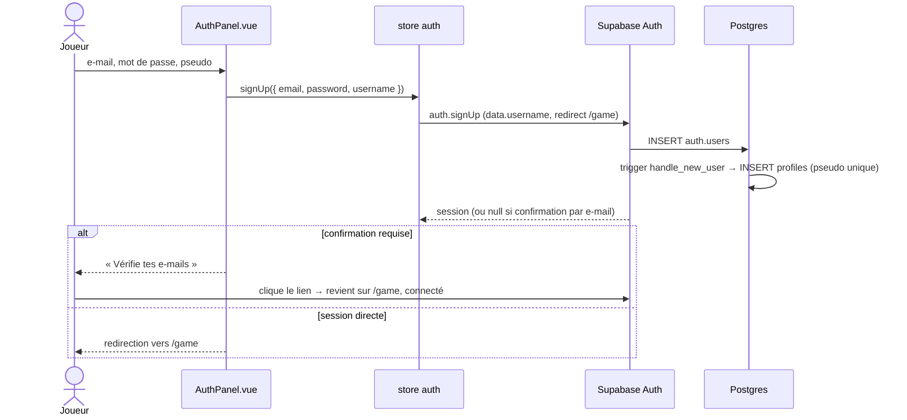
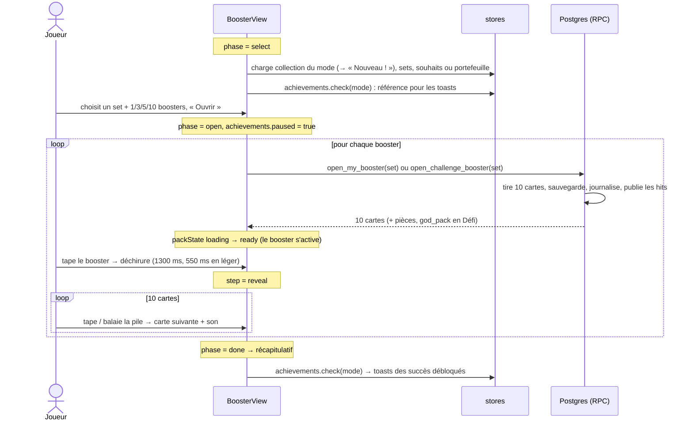
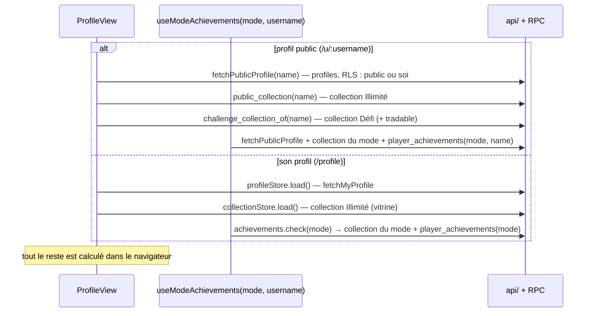
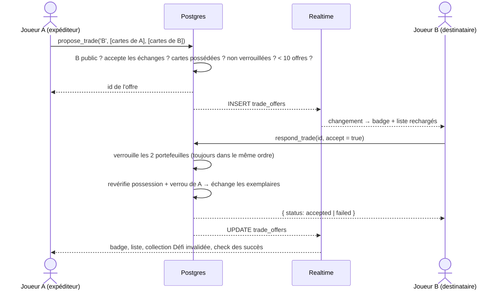
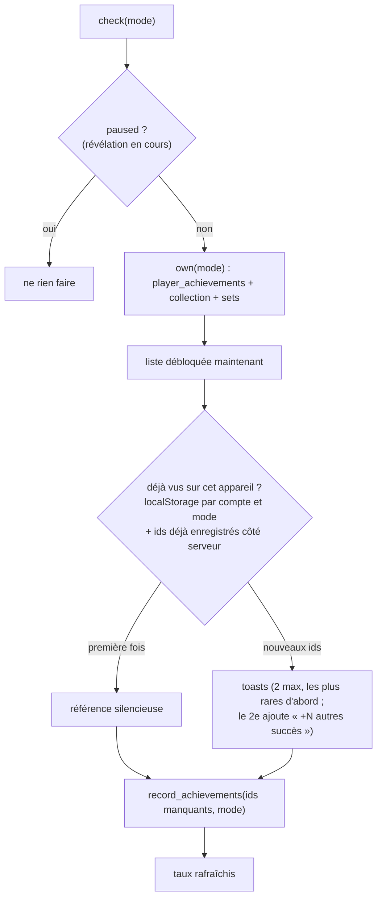
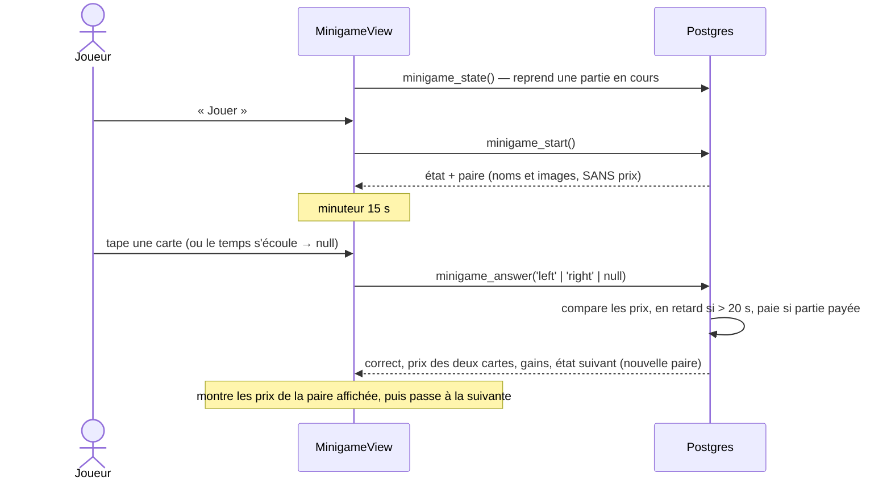
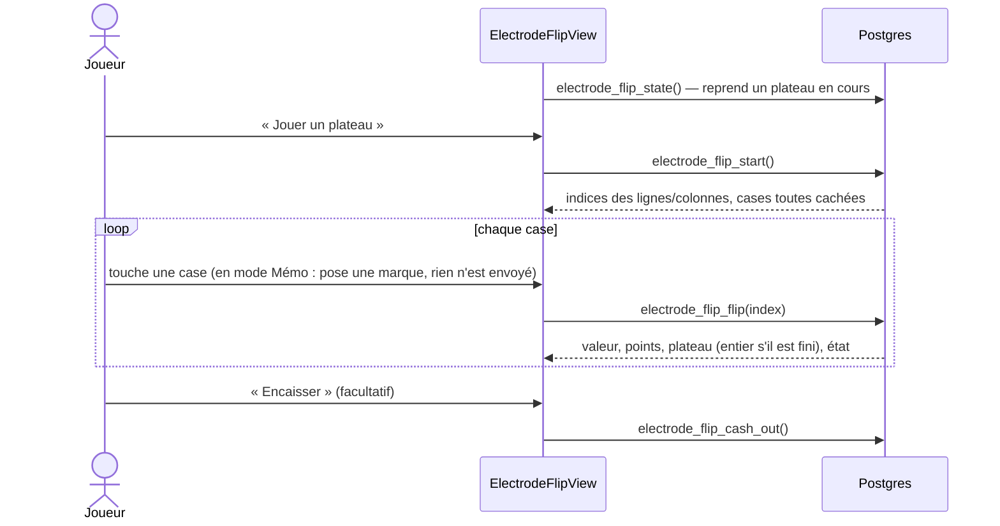
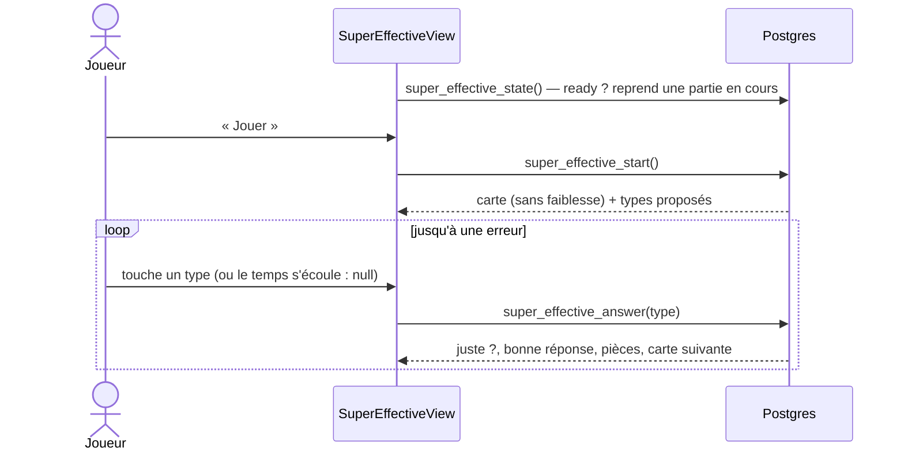
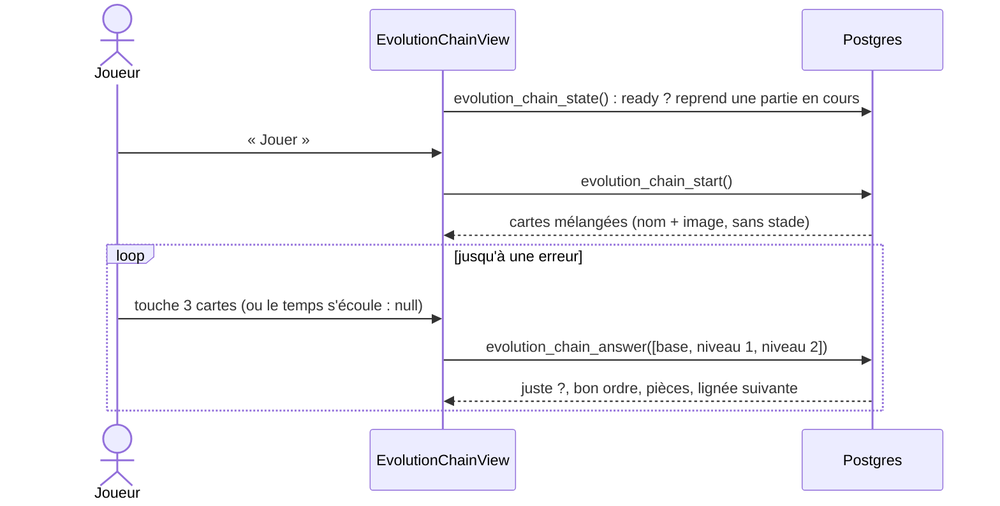
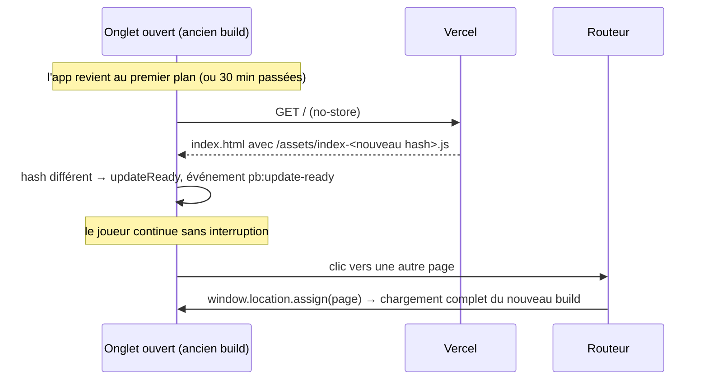

# 5. Parcours détaillés

[← Référence API](04-reference-api.md) · [Sommaire](README.md) · Suivant : [Outillage →](06-outillage.md)

Chaque section suit un scénario de bout en bout : ce que fait la vue, quel
store intervient, quelles requêtes partent, ce que le serveur fait et ce
qui revient à l'écran.

1. [Inscription et connexion](#1-inscription-et-connexion)
2. [Ouvrir un booster](#2-ouvrir-un-booster)
3. [Afficher un profil](#3-afficher-un-profil)
4. [Collection et classeur](#4-collection-et-classeur)
5. [Le hub du Défi : récompenses, missions, recyclage, fabrication](#5-le-hub-du-défi)
6. [Échanger des cartes](#6-échanger-des-cartes)
7. [Succès](#7-succès)
8. [Les mini-jeux du Défi](#8-les-mini-jeux-du-défi)
9. [Communauté : fil et classements](#9-communauté--fil-et-classements)
10. [Un déploiement pendant qu'un onglet est ouvert](#10-un-déploiement-pendant-quun-onglet-est-ouvert)

---

## 1. Inscription et connexion



- **Onglet par défaut** : « Inscription » pour un nouveau visiteur,
  « Connexion » si un compte s'est déjà connecté sur l'appareil
  (`localStorage pb-has-account`, posé par le store auth à chaque session ;
  `hasAccountOnDevice()`).
- **Nom affiché en attendant le profil** : le pseudo d'inscription
  (métadonnées Auth) ou rien (`.name-skeleton`), jamais le début de
  l'e-mail : sur le vrai site, le hub a salué un nouveau compte
  « Salut jean.dupont » pendant un instant.
- **Pseudo obligatoire** à l'inscription (2 à 24 caractères,
  `validateUsername`) : sans lui, le compte prenait le début de l'e-mail,
  public par défaut. Le profil propose de le changer à ceux dont le pseudo
  est encore le début de leur e-mail (`nameFromEmail`).
- **Connexion** : `auth.signIn` → `signInWithPassword` ; la garde du
  routeur envoie ensuite `/` vers `/game`.
- **Mot de passe oublié** : `requestPasswordReset(email)` → e-mail avec un
  lien vers `/reset-password`, qui ouvre une session de récupération ;
  `ResetPasswordView` appelle `updatePassword`.
- **Changement de compte** : `onAuthStateChange` compare l'id du compte ;
  s'il change (ou à la déconnexion), `resetPlayerStores()` vide la
  collection, le Défi, les échanges, le profil, les souhaits et les
  succès. Les données d'un compte ne restent jamais affichées pour un
  autre.
- Le pseudo affiché vient de `profiles`, pas des métadonnées Auth
  (`useProfileStore().displayName`, avec l'e-mail en attendant).

---

## 2. Ouvrir un booster

Page : [BoosterView.vue](../../src/views/BoosterView.vue), la même pour
les deux modes (`/boosters` et `/challenge/boosters`, prop `mode`).

### Vue d'ensemble



### Étape par étape, côté client

1. **Au chargement de la page** :
   - la collection du mode est chargée ; ses ids servent à marquer
     « Nouveau ! » les cartes jamais possédées ;
   - en Illimité, la liste de souhaits (pour marquer « Recherchée ! ») ;
     en Défi, l'état du portefeuille (`challenge.load({ force: true })`) ;
   - `achievements.check(mode)` pose la référence des succès déjà vus ;
   - **présélection du set** : `?set=` dans l'URL, sinon le dernier set
     ouvert dans ce mode sur cet appareil (`localStorage
     pb-last-set:<mode>`, `''` = n'importe quel set), sinon (nouvel
     appareil) le set du dernier pack enregistré par le serveur
     (`fetchOpenings({ limit: 1 })`). Le nombre de boosters est retenu
     aussi (`pb-last-count:<mode>`). Un sous-set est remplacé par son
     parent (`packSetId`).
2. **Sélection** : sur ordinateur, `SetPicker` est affiché dans la page ;
   sur téléphone, il s'ouvre dans un `<dialog>` en bas de l'écran.
   Le booster affiché (`BoosterArt`) montre le logo, le symbole et la
   carte phare du set (`fetchSetCover`, mise en cache). La complétion du
   set dans le mode (cartes distinctes / `sets.total`, `setCompletion()`
   de `src/utils/collection.js`, arrondie vers le bas) s'affiche sous son
   nom et dans `SetPicker` (prop `owned`), avec un badge « Complète » à
   100 % ; elle suit les paquets ouverts pendant la visite. En Défi, le
   bouton affiche le coût (100 pièces par booster) et se désactive si le
   solde est insuffisant. **Premier booster** : tant que la collection du
   mode est vide, « Pas d'idée ? Commence par » propose le Set de base,
   151 et le set le plus récent (`starterSets()` de `src/utils/sets.js`).
   **Téléphone** : le choix 1/3/5/10 et le bouton « Ouvrir » forment un
   bloc collé au-dessus de la barre d'onglets (`.select-actions`) ; avant,
   le bouton seul restait collé et cachait le nombre. Sur un écran court
   (hauteur ≤ 760 px, iPhone SE), le booster est réduit et placé à côté
   de son nom (`.preview-row`), pour que le nom reste visible. Le bloc
   s'appelle `.select-actions` (`.open-actions` est celui de la phase
   d'ouverture : partager le nom les avait mélangés). **Ordinateur** : le
   même bloc colle au bas de la fenêtre et le booster rétrécit sous 820 px
   de haut ; sur un portable 1280×720, le bouton était sous la ligne de
   flottaison.
3. **`startOpening()`** : retient le set et le nombre, passe en
   `phase = 'open'`, puis `prepareBooster()`.
4. **`drawPack()`** : **un appel serveur par booster**. Le pack est tiré
   **et sauvegardé** avant toute animation : quitter la page en pleine
   révélation ne fait perdre aucune carte. Ensuite :
   - la collection du mode est invalidée (et la liste de souhaits en
     Illimité) ;
   - les cartes sont triées pour la révélation (`sortForReveal` : communes
     d'abord, meilleure carte à la fin) et marquées `isNew` / `isWanted` ;
   - les images sont préchargées ; `packState = 'ready'` active le booster.
5. **Déchirure** : un tap sur `BoosterPack` → `packState = 'tearing'`, son
   `tear`, puis au bout de `TEAR_MS` (1300 ms) ou `TEAR_MS_LITE` (550 ms)
   → `step = 'reveal'` et la pile `CardStack` apparaît.
6. **Révélation** : chaque tap (ou balayage de la carte face visible)
   incrémente `revealedCount`. `playReveal` joue `flip` (+ `rare` pour une
   rare/holo) ; un **hit** (ultra/secret) se « charge » 0,55 s face cachée,
   se retourne avec un flash, joue `hit` et vibre. Son nom et ses badges
   n'apparaissent qu'à ce moment : rien n'est dévoilé à l'avance.
7. Après la 10e carte, un tap → `finishBooster()` : booster suivant
   (retour à l'étape 4) ou `phase = 'done'`.
8. **« Tout ouvrir d'un coup »** (`openAllNow`) : tire les boosters
   restants à la suite, sans animation, puis affiche le récapitulatif.
9. **Récapitulatif** : cartes regroupées par quantité et triées par
   rareté, nombre de nouvelles cartes, meilleure carte (`bestPull`),
   bouton de partage (`shareCard`). Les packs divins du Défi sont
   signalés. Sous 992 px, « Rouvrir » et « Changer de série » restent
   collés au-dessus de la barre d'onglets (`position: sticky`) ; la vue
   pose `html.pb-action-bar`, et les toasts de succès (en bas sur
   téléphone, au-dessus de la barre d'onglets) montent au-dessus.
10. **Succès** : tant que `phase === 'open'`, `achievements.paused` bloque
    toute vérification (même déclenchée ailleurs, par exemple un échange
    accepté en direct) pour ne rien dévoiler. En `done`, `check(mode, {
    delay: 1500 })` affiche les succès débloqués après 1,5 s, pour que la
    meilleure carte soit vue avant. Partout, **2 toasts au plus** (les plus
    rares) ; le second ajoute « +N autres succès » et mène aux succès
    débloqués : un premier booster en débloquait 16 d'un coup. Pendant le
    récapitulatif sur téléphone (`html.pb-action-bar`) ils tiennent sur
    une ligne (petit trophée, titre, « +N »), et la meilleure carte se
    place à côté de son nom et de « Partager » (empilés, « Partager »
    passait sous la barre collée) ; le bouton
    « Autre série » remplace « Changer de série » (sur deux lignes).

Si un appel échoue (réseau, pièces insuffisantes), le message s'affiche
et on revient à la sélection, ou au récapitulatif si des cartes ont déjà
été tirées.

### Côté serveur : Illimité

`open_my_booster(p_set_id)` (migrations 0004 puis 0005) :

1. `require_player()` : erreur si pas connecté.
2. `check_booster_rate()` : refuse au-delà de 60 packs dans la minute.
3. `open_booster(p_set_id)` : tire les 10 cartes (ci-dessous).
4. `save_booster_opening(user, 'unlimited', cards)` :
   - `INSERT INTO collections … ON CONFLICT DO UPDATE SET quantity =
     quantity + excluded.quantity` (atomique : jamais de « lire puis
     écrire » côté client) ;
   - `INSERT booster_openings` (ids, meilleure carte, nombre de hits) ;
   - retire les cartes tirées de `wishlist` ;
   - si le profil est public, ajoute les ultra/secret à `pull_feed` (que
     Realtime diffuse aussitôt) ; si le set du pack n'a ni ultra ni
     secrète (Base Set…), ses holo à la place (`feed_buckets`, 0016 ; une
     carte de sous-set ne compte pas) ; purge de temps en temps les lignes de
     plus de 30 jours.
5. Renvoie les 10 cartes.

### Côté serveur : Défi

`open_challenge_booster(p_set_id)` (migration 0006) :

1. Verrouille le portefeuille (`lock_challenge_wallet`) : deux onglets ne
   peuvent pas dépenser les mêmes pièces.
2. Limite de fréquence ; `not_enough_coins` sous 100 pièces.
3. Tire un pack normal avec `open_booster`, qui choisit aussi le set si
   « n'importe quel set ».
4. Une fois sur 500 : **pack divin**. Les 10 cartes sont retirées dans le
   même set sur les slots holo ×6, ultra ×3, secret ×1.
5. Débite 100 pièces, ajoute une ligne `booster` (−100) au journal.
6. `save_booster_opening(user, 'challenge', cards, god_pack)` (la liste
   de souhaits n'est pas touchée : elle appartient à l'Illimité).
7. Renvoie `{ cards, coins, god_pack }`. Le store met le solde à jour et
   marque l'état `stale` : la progression des missions sera relue en
   arrière-plan.

Il n'y a **pas de « pity timer »** : les taux sont les mêmes qu'en
Illimité (décision du 2026-09-25, migration 0006).

### Le tirage côté serveur (`open_booster`)

`open_booster(p_set_id)` (migrations 0003, puis 0010 pour les sous-sets)
construit un pack **slot par slot**, comme un vrai booster moderne. Ne
jamais revenir à un tirage uniforme : il donnait ~4 rares et 1 ou 2 hits
par pack.

1. **Choix du set** : un sous-set demandé → le set parent ; `null` → un
   set réel au hasard (pas un sous-set, au moins 4 communes et une rare).
   Un pack ne mélange jamais plusieurs sets.
2. **Les slots** :

| Slot | Contenu |
| --- | --- |
| 1–4 | commune |
| 5–7 | peu commune |
| 8 | reverse : 50 % commune, 38 % peu commune, 12 % rare. **Ou une carte du sous-set**, avec la probabilité `subset_rate` du sous-set (si le set en a un) |
| 9 | reverse / hit : 31 % commune, 35 % peu commune, 25 % rare, 8,2 % ultra, 0,8 % secret |
| 10 | slot rare : 70 % rare, 21 % holo, 8 % ultra, 1 % secret |

   Résultat : environ 1 holo sur 5 packs, 1 ultra ou mieux sur 5 à 6
   packs, 1 secret sur ~55 packs. Ces taux ont été vérifiés en simulant
   3000 packs par set.
3. **Chaque carte** (`pick_booster_card`) : une carte au hasard de la
   rareté voulue ; si le set n'en a pas, la rareté inférieure qui existe
   (Base Set n'a pas d'ultra : ses tirages « ultra » deviennent des holo).
   Pas de doublon dans un pack, sauf si le set est trop petit.
4. **Carte de sous-set** (`pick_subset_card`) : holo 60 %, ultra 36 %,
   secret 4 % (ou la rareté la plus proche que le sous-set possède).

---

## 3. Afficher un profil

Page : [ProfileView.vue](../../src/views/ProfileView.vue), pour
`/profile` (le sien, modifiable) et `/u/:username` (public, lecture
seule, visible même sans être connecté).

### Ce qui est chargé



### D'où vient chaque chiffre

Un sélecteur **Défi | Illimité** en haut de la colonne principale pilote
toutes les statistiques. Les deux collections sont séparées : un joueur
qui ne joue qu'en Défi afficherait « 1 booster, 0 € » si on ne lisait que
l'Illimité (bug corrigé le 2026-09-27).

- **Mode par défaut** : son propre profil s'ouvre sur le mode d'où vient
  le joueur (`routeMode`). Le profil de quelqu'un d'autre s'ouvre sur le
  Défi, puis passe sur l'Illimité si la collection Défi est vide et
  l'Illimité non (tant que le visiteur n'a pas choisi lui-même).
- `useModeAchievements(mode, username)` fournit `entries` (la collection
  de ce mode) et `server` (réponse de `player_achievements`).

| Élément affiché | Calcul |
| --- | --- |
| **Boosters ouverts** | `packSummary({ mode, totalCards, server }).total`. En Défi : le compte du serveur (`booster_openings`), car recyclage, fabrication et échanges changent le nombre de cartes. En Illimité : le max de « cartes ÷ 10 » et du compte serveur (les packs d'avant 0004 n'étaient pas journalisés, mais la collection Illimité ne grandit que par paquets de 10) |
| **Niveau et rang** | `rankFor(boosters)` : Débutant 0, Dresseur 10, Collectionneur 50, Expert 150, Maître 400, Légende 1000 boosters. La carte du dresseur indique le mode |
| Cartes tirées, uniques, sets commencés, valeur | `collectionStats(entries)` : somme des quantités, nombre de lignes, sets distincts, somme de `value × quantité` |
| Répartition des raretés | `rarityBreakdown(entries)` : cartes uniques par rareté |
| Succès (progression, « Presque ! ») | `modeAchievements.list` → `achievementProgress`, `nextUp` |
| Meilleures cartes (profil public) | Les 8 premières de `sortEntries(entries, 'rarity')` |
| **Badge Bêta-testeur** | `isBetaTester(created_at)` (`utils/beta.js`) : tout compte créé avant `BETA_END`. Tant que `BETA_END = null`, tout le monde l'a ; le jour où la bêta se termine, on y met la date et seuls les comptes plus anciens le gardent. Pas de colonne en base |
| **Carte vitrine** | Toujours la collection **Illimité** : la carte choisie (`showcase_card_id`), sinon la meilleure carte (`bestPull`) |
| Collection du mode choisi (profil public) | Suit le sélecteur Défi \| Illimité. Défi : `challenge_collection_of`, bouton « Demander » → `/challenge/trades?to=<pseudo>&want=<id>`, « Pas à échanger » si verrouillée. Illimité : `public_collection`, consultation seule (les échanges n'existent qu'en Défi). Triée par rareté, 24 par page, recherche |

### Actions sur son propre profil

| Action | Appel |
| --- | --- |
| Changer de pseudo | `validateUsername` (2–24 caractères) puis `profileStore.update({ username })`. Pris → « déjà utilisé » (unicité sans tenir compte de la casse) |
| Choisir la vitrine | `ShowcasePicker` → `update({ showcase_card_id })` ; le serveur refuse une carte non possédée |
| Profil public/privé | `update({ is_public })`. Un profil privé disparaît du fil, des classements et de `/u/…` |
| Réglages (son, vibration, effets, texte agrandi, animations) | Lien « Réglages : son, texte plus grand… » en haut de la carte du dresseur (`#profile-settings` : ils sont au 10e écran sur téléphone). `settingsStore.set()`, par appareil, rien côté serveur. « Texte plus grand » (`largeText`) : `html.pb-text-large` agrandit tous les `rem` (112,5 %) et fonce `--pb-text-muted` |
| Installer l'app | `promptInstall()` |
| Déconnexion | `auth.signOut()` puis retour à l'accueil (bouton sur cette page uniquement) |

---

## 4. Collection et classeur

**Collection** ([CollectionView.vue](../../src/views/CollectionView.vue),
`/collection` et `/challenge/collection`) :

- Au chargement : collection du mode, sets ; en Illimité la liste de
  souhaits ; en Défi le portefeuille, la collection Illimité (pour
  rassurer : « tes cartes Illimité sont en sécurité ») et les verrous
  d'échange.
- **Onglets** : Cartes, Sets, Pokédex, Souhaits (pas de Souhaits en Défi).
- **Filtres dans l'URL** : `?view=&q=&set=&rarity=&dupes=1&sort=&dex=`.
  Changer d'onglet, de set ou de Pokémon crée une entrée d'historique
  (le bouton retour y revient) ; taper ou ajuster un filtre remplace
  l'entrée courante.
- Tout le filtrage/tri est local (`filterEntries`, `sortEntries`) : la
  collection est chargée en une requête, puis affichée 48 cartes à la fois
  au fil du défilement (`IntersectionObserver`).
- **Recherche en français** : les noms de cartes sont en anglais ; la
  recherche compare aussi le nom français du Pokémon (`frenchName()` de
  `src/utils/pokemonNamesFr.js`, par numéro du Pokédex), donc
  « Dracaufeu » trouve « Charizard ex ». Même chose dans les sélecteurs
  d'échange (`searchEntries`). En français, la fiche d'une carte affiche
  « En français : Dracaufeu » sous le nom (sauf si c'est le même mot).
  Le Pokédex nomme aussi les espèces en français (`PokedexGrid`). La
  rareté de la fiche est celle du site, traduite (« Secrète »), avec la
  rareté imprimée en note (« Sur la carte (en anglais) : Special
  Illustration Rare ») : pokemontcg.io n'a que les noms anglais, et on
  n'invente pas les noms officiels français.
- **Objectif à portée** : sous « Cartes uniques 10 / 20 670 », `SetGoal`
  affiche la série la plus avancée (`setProgress()[0]`) avec un lien vers
  son classeur ; aussi sur les tuiles collection des deux hubs.
- En Défi : `RecycleDuplicates` (« N doublons → +X pièces », en deux
  temps) ; la fiche carte propose de fabriquer ou recycler.
- La fiche carte (`CardDetail`) charge l'historique de prix
  (`fetchPriceHistory`) et permet de parcourir la liste (flèches,
  balayage).

**Classeur** ([SetBinderView.vue](../../src/views/SetBinderView.vue),
`/collection/set/:setId`) : `fetchSetCards(setId)` donne toutes les cartes
du set ; `binderSlots` les range par numéro et y associe les quantités
possédées. Les cartes manquantes sont grisées ; en Défi, elles affichent
leur prix de fabrication. Les cartes d'un sous-set sont signalées comme
venant des boosters du parent.

---

## 5. Le hub du Défi

Page : [ChallengeView.vue](../../src/views/ChallengeView.vue) (`/challenge`).

Au chargement : `challenge.load({ force: true })` (**crée le portefeuille
avec 1000 pièces au premier passage**), la collection Défi, le statut des
mini-jeux ; un minuteur recharge l'état juste après 00:00 UTC.

Ordre de la page : ce qui attend le joueur (`.ch-waiting` : récompense du
jour, missions finies, offres), puis les tuiles, portefeuille en premier.
**Première visite** : « Le défi en bref » (3 lignes, `.ch-brief`) se place
sous le portefeuille jusqu'à « Compris » (`localStorage
pb-challenge-rules-seen`) et remplace le sous-titre ; son lien « Toutes
les règles » ouvre « Comment marche le défi » (`<details>`, replié, en bas
de page). Ouvertes en haut, les règles complètes repoussaient le bouton
« Ouvrir des boosters » au 3e écran du téléphone. La récompense du jour ne
se réclame que depuis l'encadré du haut ; la tuile garde la série de 7
jours et renvoie vers ce bouton. Sur téléphone, la tuile Succès n'affiche
pas « Presque ! » (la page des succès les a). Les règles (Défi,
mini-jeux) et l'historique donnent l'heure de remise à zéro dans l'heure
de l'appareil (`resetTimeLabel()`, « 02:00 »), plus « minuit UTC ».

| Action | Store → RPC | Ce que fait le serveur |
| --- | --- | --- |
| Récompense quotidienne | `challenge.claimDaily()` → `claim_daily_reward` | Série +1 si réclamée hier, sinon 1 ; 200 + 50 × (série − 1), plafond 500 ; journal `daily` |
| Réclamer une mission | `challenge.claimMission(id)` → `claim_mission` | Vérifie progression ≥ objectif et pas déjà réclamée (index unique du journal) ; crédite ; journal `mission` |
| Recycler les doublons | `challenge.recycle(cardId?)` → `recycle_duplicates` | Ramène chaque carte à 1 exemplaire ; crédite selon la rareté ; journal `recycle` avec la quantité (compte pour la mission) |
| Garder plus d'un exemplaire | « Garder » (1 à 4 exemplaires de chaque, `settings.recycleKeep`, par appareil) dans `RecycleDuplicates` : au-delà de 1, « Recycler » envoie les copies en trop de chaque carte à `recycle_card_copies` | Ramène chaque carte au nombre gardé |
| Recycler depuis une carte | Fiche de la carte : − / + (`CopyStepper`) puis « Recycler N doublons » ; tous → `recycle_duplicates(id)`, une partie → `recycle_card_copies` | Retire ce nombre d'exemplaires |
| Recycler une sélection | « Choisir… » dans `RecycleDuplicates` (case par carte = tous ses doublons, − / + pour n'en prendre que certains, puces par rareté, `duplicateGroups`) → `challenge.recycle({ picks, extras })` → `recycle_card_copies` (0020) | Retire le nombre d'exemplaires choisi de chaque carte (au plus ses doublons) |
| Fabriquer une carte | `challenge.craft(card)` → `craft_card` | Débite le prix de la rareté ; +1 exemplaire ; journal `craft` |

Après chaque action, le store remplace l'état par celui renvoyé par le
serveur, rafraîchit le badge (`loadBadge`) et appelle
`achievements.check('challenge')`.

**Missions** (progression calculée par le serveur à chaque lecture) :

| Id | Objectif | Récompense | Compté depuis |
| --- | --- | --- | --- |
| `open_packs` | 3 boosters Défi aujourd'hui | 75 | `booster_openings` |
| `pull_holo` | 1 pack dont la meilleure carte est holo ou mieux | 100 | `booster_openings.best_card_id` |
| `recycle` | 5 doublons recyclés aujourd'hui | 50 | `challenge_ledger` |
| `week_open_packs` | 25 boosters cette semaine | 400 | |
| `week_pull_ultra` | 2 ultra ou mieux cette semaine | 400 | |
| `week_recycle` | 50 doublons recyclés cette semaine | 250 | |
| `week_daily` | récompense quotidienne réclamée 5 jours | 300 | |

Sur téléphone (< 576 px), les missions de la semaine sont repliées sous
leur titre (« Cette semaine 0/4 »), sauf si l'une est prête à être
réclamée ; une fois ouvertes, elles le restent pendant la visite.

**Badge** : `challenge_badge()` compte ce qui attend le joueur
(récompense du jour, missions finies non réclamées, offres reçues,
réponses à ses offres pas encore vues). Récompenses sur les liens du Défi,
offres + réponses (`challenge.tradeNews`) sur les liens Échanges (sur
téléphone : le raccourci ⇄ de la bande « Mode Défi », il n'y a pas
d'onglet Échanges) ; hors du Défi tout s'additionne sur Défi / Accueil. Il
s'affiche et chaque badge a sa raison visible sur
la page où il mène (encadré `.ch-waiting` en haut de `/challenge`).

---

## 6. Échanger des cartes

Page : [TradesView.vue](../../src/views/TradesView.vue)
(`/challenge/trades`). Uniquement avec la collection Défi (en Illimité,
toute carte est à un booster près).

**Nouveau joueur** : collection Défi vide → un encadré en haut de « Nouvelle
offre » dit d'ouvrir d'abord des boosters du défi (lien). Sous le champ
du partenaire, « Ou choisis un dresseur qui a une grosse collection »
propose jusqu'à 6 pseudos du classement « Le plus de cartes »
(`leaderboard('challenge_unique')`, jamais soi-même) ; un tap ouvre ses
cartes comme une recherche.



- **Préparer une offre** : `?to=<pseudo>` préremplit le partenaire (lien
  depuis un profil), `?want=<id>` une de ses cartes. Le champ pseudo
  propose les dresseurs publics qui commencent par ce qui est tapé
  (`UsernameCombobox`, ceux qui refusent les échanges sont signalés) ;
  choisir une suggestion charge directement sa collection. La collection du
  partenaire vient de `challenge_collection_of`. Sélecteurs : 5 cartes au
  maximum par côté (`toggleCard`), 60 résultats affichés puis 60 de plus
  par « Voir plus » (une nouvelle recherche repart à 60). Chaque carte des deux côtés dit combien d'exemplaires on en a
  dans sa collection Défi (« Tu en as 2 », « Nouvelle pour toi »).
- **Règles** (serveur) : 1 à 5 cartes offertes, 0 à 5 demandées (0 =
  cadeau), un exemplaire de chaque, 10 offres en attente au maximum,
  expiration après 7 jours, partenaire public qui accepte les échanges.
- **Accepter** : l'échange est atomique. Si une carte n'est plus possédée,
  ou si l'expéditeur a verrouillé une carte offerte entre-temps, l'offre
  finit en `failed`, sans rien déplacer. `move_challenge_cards` supprime
  le dernier exemplaire ou décrémente, puis ajoute chez l'autre.
- **Qui l'a en double ?** (0022) : sur la fiche d'une carte Défi
  manquante, le bouton appelle `card_traders` et liste les dresseurs
  (pseudo, nombre d'exemplaires) avec « Demander » →
  `/challenge/trades?to=<pseudo>&want=<id>`.
- **Contre-offre** (0021) : « Contre-proposer » sur une offre reçue la
  charge dans le formulaire, côtés inversés (`countering`) ; on change les
  cartes et on envoie → `trades.counter(id, …)` → `counter_trade`. L'offre
  d'origine finit en « Contre-offre » (`countered`), la nouvelle arrive
  chez l'autre joueur marquée « Contre-offre » (toast `counter`), et peut
  elle-même recevoir une contre-offre. « Faire une nouvelle offre à la
  place » quitte ce mode.
- **Préférences** : « Accepter les échanges » (`profiles.accepts_trades`) ;
  les offres déjà reçues restent possibles à accepter. Cartes verrouillées :
  `trades.toggleLock(id)` (optimiste, annulé en cas d'erreur).
- **Temps réel** : `App.vue` lance `trades.live(userId)` dès la connexion.
  À chaque changement : badge rafraîchi, liste rechargée si elle était
  chargée ; si l'offre est acceptée, collection Défi invalidée et
  vérification des succès. Une **nouvelle offre reçue** ou une **réponse à
  une de mes offres** (`tradeNews(row, userId)` : acceptée, refusée,
  échouée, `answer_seen` faux) affiche un toast (dans la pile des toasts de
  succès, 8 s, une fois par offre et par session) qui mène aux échanges.
- **Réponses vues** : en ouvrant `/challenge/trades`, les offres `unseen`
  passent en tête (« Nouvelles réponses à tes offres », gardées pendant la
  visite) et `trades.markSeen()` appelle `mark_trade_answers_seen` : le
  badge disparaît, sur tous les appareils.
- **Raccourcis** : `?give=<id>` précoche une de mes cartes ; la fiche d'une
  carte de ma collection Défi a « Proposer en échange » (sauf carte
  verrouillée).

---

## 7. Succès

Définitions : [src/utils/achievements.js](../../src/utils/achievements.js)
(~1210, 20 catégories, sous-catégories `sub` dans les grosses, tags de
région `tags` pour le filtre « Région », `?region=`). Les groupes de Pokémon (lignées d'évolution,
légendaires et fabuleux, équipes des champions d'arène de Kanto et Johto,
Conseil 4, Maîtres de la Ligue, rivaux et héros, lieux et leurs Pokémon
sauvages) sont des listes de numéros du Pokédex dans
[src/utils/pokemonGroups.js](../../src/utils/pokemonGroups.js), et tout
Kanto (lignées de Rouge/Bleu, routes, lieux, villes et dresseurs sur leurs
cartes, reconnus par le nom de la carte) dans
[src/utils/kanto.js](../../src/utils/kanto.js), puis une région par
fichier sur le même modèle : Johto
([src/utils/johto.js](../../src/utils/johto.js) : lignées d'Or/Argent,
routes 29 à 46, grottes et tours, Conseil 4 et Maître Peter, lieux et
dresseurs en cartes, séries Neo et HGSS) et Hoenn
([src/utils/hoenn.js](../../src/utils/hoenn.js) : lignées de
Rubis/Saphir, routes 101 à 134, grottes et sommets, badges, Conseil 4,
Timmy, Max et Arthur, Team Magma et Team Aqua en cartes, premières séries
EX et époque ROSA) et Sinnoh
([src/utils/sinnoh.js](../../src/utils/sinnoh.js) : lignées de
Diamant/Perle, fossiles, bébés et nouvelles évolutions de DP, formes et
nouveaux Pokémon de Hisui, routes 201 à 230, lacs et grottes, badges,
Conseil 4, Hélio, Cynthia et Team Galaxie en cartes, séries DP, Platine
et 2022) et Unys
([src/utils/unova.js](../../src/utils/unova.js) : lignées de Noir/Blanc,
solitaires, fossiles, singes d'Ogoesse, routes 1 à 18 (ids `unovaRoute<n>`,
pour ne pas croiser celles de Kanto), Tour Dragospire, Grotte Cyclopéenne
et autres lieux, badges, Conseil 4, N et Ghetis, N et Team Plasma en
cartes, séries Noir & Blanc, Plasma, Foudre Noire et Flamme Blanche) et
Kalos ([src/utils/kalos.js](../../src/utils/kalos.js) : lignées de X/Y,
solitaires, fossiles, routes 2 à 22 (`kalosRoute<n>`), Forêt de
Neuvartault, Grotte Coda et autres lieux, badges, Conseil 4, Lysandre et
AZ, Dianthéa et Team Flare en cartes, séries XY et Méga-Évolution) et
Alola ([src/utils/alola.js](../../src/utils/alola.js) : lignées de
Soleil/Lune, solitaires, Pokémon Dominants, routes 1 à 17
(`alolaRoute<n>`), Colline Dicarat, Grand Canyon de Poni et autres lieux,
grandes épreuves des doyens (Alola n'a pas d'arènes), Conseil 4,
Elsa-Mina, Guzma et Euphorbe, doyens, capitaines, Lilie, Fondation Æther
et Team Skull en cartes, séries Soleil et Lune) et Galar
([src/utils/galar.js](../../src/utils/galar.js) : lignées d'Épée/Bouclier,
solitaires, fossiles, routes 1 à 10 (`galarRoute<n>`), Forêt de Sleepwood,
mines et Forêt de Lumirinth (pas les zones de la Zone Sauvage, jusqu'à 87
Pokémon chacune), les 10 badges des deux versions, Rosemary, Travis,
Shehroz et Liv, champions, Tarak, rivaux, Team Yell et 5 villes en
cartes, séries Épée et Bouclier) et Paldea
([src/utils/paldea.js](../../src/utils/paldea.js) : lignées d'Écarlate/Violet,
solitaires, Pokémon Dominants d'« Un parfum de légende », Pokémon Paradoxe
du passé et du futur, arènes, Conseil 4, Alisma, Pepper, Pania et les IA
des professeurs, champions, Conseil 4, amis, Team Star et personnel de
l'Académie en cartes, Mesaledo, Cuencia et Levalendura, séries Écarlate et
Violet ; pas de routes ni de lieux : PokéAPI n'a pas les Pokémon sauvages
d'Écarlate/Violet, `routes` et `landmarks` sont donc facultatifs). Équipes et noms officiels vérifiés sur PokéAPI et Poképédia ; leur
description nomme les membres (`achievements.desc.groups.<id>`), donc
changer une liste = changer ses deux textes. **Calculés dans le navigateur, par mode.** Le
Défi est mis en avant, c'est celui qui compte.

### Calcul

`achievements(entries, sets, { mode, unlocked, packs, stats })` :

1. `collectorStats` parcourt la collection **une seule fois** et en tire
   tout ce dont les définitions ont besoin : uniques, total, valeur,
   raretés, sets (et pourcentage de complétion), Pokédex, types, sous-types
   (EX, GX, V…), artistes, noms de cartes, années, etc. Plus les statistiques serveur
   (`stats` de `player_achievements`) : packs avec hit, meilleure journée,
   séries, sets ouverts ; en Défi, échanges, cadeaux, pièces gagnées,
   missions, fabrications, recyclage.
2. Chaque définition donne une `metric(stats)` et une `target`. Débloqué
   si `metric ≥ target`, **ou** si l'id est déjà dans `unlocked` (côté
   serveur) : un succès ne se reperd pas quand la collection Défi
   rétrécit.
3. `modes: [...]` réserve une définition à un mode (économie, pack divin =
   Défi) ; `hidden` affiche « ??? » tant que ce n'est pas débloqué.

Ajouter une définition la débloque **rétroactivement** pour tous ceux qui
remplissent déjà la condition, sans migration.

### Notifications (toasts)



`check()` est appelé au chargement de `BoosterView` et à son
récapitulatif, sur les pages qui affichent ses propres succès (profil,
page des succès, hub du Défi), et juste après chaque action du Défi qui
peut en débloquer un (récompense, mission, recyclage, fabrication,
échange, fin de partie du mini-jeu). Un id déjà enregistré par le serveur
compte comme « vu » : un autre appareil l'a déjà annoncé.

### Taux (« 12 % des joueurs »)

Le client déclare ses ids débloqués (`record_achievements`, retenté tant
que le serveur n'a pas confirmé) et lit `achievement_rates(mode)` (mis en
cache 10 min). C'est l'exception assumée à la règle « le serveur écrit » :
les ids sont déclarés par le client, mais ils ne font varier qu'un
pourcentage anonyme.

### Pages

`AchievementsView` : `/achievements`, `/challenge/achievements` et
`/u/:pseudo/achievements?mode=`. Sélecteur Défi | Illimité, recherche,
filtres catégorie/statut dans l'URL (`?cat=&status=&q=`), catégories
repliables (mémorisées par appareil dans `pb-achievements-collapsed`).

---

## 8. Les mini-jeux du Défi

Les deux suivants, « Chaîne d'évolution » et « Raid de boss », sont
annoncés sur la page des jeux (« Bientôt disponible », non cliquables) ;
rien n'est encore codé côté serveur.

### « Plus ou moins »

Page : [MinigameView.vue](../../src/views/MinigameView.vue)
(`/challenge/games/higher-lower`), store `minigame`, migration 0013.

Deux cartes : taper la plus chère (prix Cardmarket `cards.value`) en
moins de 15 secondes. La partie dure jusqu'à la première erreur.



- **Règles** (**miroir** : `minigame_rules()` et `src/utils/minigame.js`) :
  3 parties payées par jour de jeu (UTC), 5 pièces par bonne réponse sur
  les 20 premières d'une partie (100 par partie, 300 par jour au
  maximum), puis parties illimitées non payées pour le record.
- **Difficulté** : l'écart de prix se resserre avec la série. La carte la
  plus chère vaut au moins ×3 (série 0–2), ×2 (3–5), ×1,5 (6–9), puis
  ×1,25, et au plus le double de ce ratio.
- **Anti-triche** : le serveur garde les prix jusqu'à la réponse ; le
  client ne connaît que les noms et les images. Une réponse arrivée après
  20 s (15 s + marge d'affichage et de réseau) ou `null` termine la
  partie. Limite acceptée : les prix sont publics (table `cards`), un
  script pourrait les chercher, mais le plafond quotidien borne le gain.
- Chaque bonne réponse payée = une ligne `minigame` dans le journal (elle
  compte dans les « pièces gagnées » des succès).
- Côté vue, la paire affichée (`shown`) reste en place pendant que les
  prix s'affichent, même si le store a déjà reçu la suivante. La liste des
  cartes boucle sur la constante `SIDES`, avec le côté pour clé : une clé
  qui changeait à chaque paire faisait disparaître les prix.

### « Électrode Shiny Flip »

Page : [ElectrodeFlipView.vue](../../src/views/ElectrodeFlipView.vue)
(`/challenge/games/electrode-flip`), store `electrodeFlip`, migration 0014.

Le Voltorbataille (Voltorb Flip) de HeartGold/SoulSilver, avec des
Électrode shiny : 25 cases cachent des 1, 2, 3 et des Électrode ; au bout
de chaque ligne et colonne, la somme de ses points et son nombre
d'Électrode.



- **Règles** (**miroir** : `electrode_flip_rules()` / `electrode_flip_end()`
  et `src/utils/electrodeFlip.js`) : points = produit des cases
  retournées. Tous les 2 et 3 retournés → plateau gagné, niveau + 1
  (5 niveaux, dispositions de Voltorb Flip niveaux 1 à 5 :
  `electrode_flip_layout()`, de 6 à 10 Électrode). Un Électrode → perdu,
  0 point. Encaisser garde les points. Après une défaite ou un
  encaissement, le niveau descend au nombre de cases retournées s'il est
  plus bas (au moins 1).
- **Pièces** : points = pièces, 300 par jour de jeu (UTC) au maximum
  (`electrode_flip_today()` additionne les plateaux du jour) ; ensuite
  les plateaux se jouent pour le record (meilleur plateau, meilleur
  niveau). Une ligne `electrode_flip` par plateau payé dans le journal
  (compte dans les « pièces gagnées »).
- **Anti-triche** : le plateau reste sur le serveur, le client ne reçoit
  que les indices et les cases déjà retournées. `electrode_flip_start()`
  reprend le plateau en cours au lieu d'en redistribuer un, pour qu'on ne
  puisse pas fuir un plateau mal parti en rechargeant.
- **Mémo** : marques (Électrode, 1, 2, 3) posées sur les cases cachées,
  purement locales à la vue ; le clic droit marque un Électrode. Les
  lignes sans Électrode sont en vert, celles qui n'ont que des 1 et des
  Électrode sont estompées (`lineKind()`).
- Électrode dessiné en CSS (tokens `--pb-electrode-*`, bleu shiny).

### « Super efficace ! »

Page : [SuperEffectiveView.vue](../../src/views/SuperEffectiveView.vue)
(`/challenge/games/super-effective`), store `superEffective`, migration 0015.

Une carte Pokémon s'affiche, recadrée sur sa moitié haute (nom, PV, type,
illustration) : sa faiblesse est imprimée en bas. On touche le type
auquel elle est faible (ou les touches 1 à 6 au clavier).



- **La réponse** vient de la carte elle-même : `cards.weaknesses`
  (pokemontcg.io, rempli par `scripts/populate.mjs` depuis 0015). Pas de
  table des types à maintenir, et la réponse suit les règles de l'époque
  de la carte. Si une carte a deux faiblesses, l'une est la réponse et
  l'autre n'est jamais proposée. Incolore n'est jamais proposé.
- **Règles** (**miroir** : `super_effective_rules()` et
  `src/utils/superEffective.js`) : 10 s par question (le serveur accepte
  15 s), 3 types au choix (série 0–4), puis 4 (5–9), puis 6. Mêmes gains
  que « Plus ou moins » : 3 parties payées par jour, 5 pièces par bonne
  réponse pour les 20 premières (100 par partie, 300 par jour), ensuite
  pour le record. Une ligne `super_effective` par réponse payée dans le
  journal.
- **Avant l'import** : tant qu'aucune carte n'a de faiblesse,
  `super_effective_state()` renvoie `ready: false` et le jeu affiche
  « Bientôt » au lieu d'un bouton qui échouerait.
- **Anti-triche** : la réponse reste sur le serveur jusqu'au choix.
  Limite acceptée (comme les prix) : `cards` est public et l'image
  complète montre la faiblesse, un script pourrait la lire ; le plafond
  quotidien borne le gain.
- Pastilles de couleur par type : tokens `--pb-type-*` (une seule série
  pour les deux thèmes, jamais derrière du texte).

### « Chaîne d'évolution »

Page : [EvolutionChainView.vue](../../src/views/EvolutionChainView.vue)
(`/challenge/games/evolution-chain`), store `evolutionChain`, migrations
0018 et 0019.

Les 2 ou 3 cartes d'une même lignée arrivent mélangées, recadrées sur leur
illustration (le stade et le « Évolue de » sont imprimés au-dessus), avec
leur nom en dessous. On les touche de la carte de base au dernier stade
(ou touches 1 à 5, Retour arrière pour reprendre la dernière) ; les
numéros 1, 2, 3 s'affichent sur les cartes et dans trois cases « De base
/ Niveau 1 / Niveau 2 ». Toucher une carte déjà choisie la reprend (avec
celles choisies après). La dernière carte (2e ou 3e) envoie l'ordre.
« Arrêter » termine la partie (`evolution_chain_stop()`, 0019) : les
pièces déjà gagnées restent, la série compte pour le record.



- **La lignée** vient des cartes : `cards.evolves_from` (pokemontcg.io
  `evolvesFrom`, rempli par `scripts/populate.mjs` depuis 0018). Le serveur
  tire un Niveau 2 au hasard, puis une impression au hasard du Niveau 1
  qu'il nomme et de la carte de base que celui-ci nomme (un stade absent de
  la base = on retire). Le numéro du Pokédex ne suffisait pas (Évoli,
  formes régionales).
- **Lignées à 2 stades** (0019, demande de l'utilisateur : « ça restreint
  beaucoup de se limiter à 3 ») : environ 2 lignées sur 5 sont une carte
  de base et un Niveau 1 dont rien n'évolue (Pikachu → Raichu, Magicarpe
  → Léviator, Évoli → Aquali…), jamais une lignée à 3 coupée
  (Salamèche → Reptincel sans Dracaufeu). Si un type ne peut pas être
  tiré, l'autre l'est. `run.length` dit au client combien de cases
  afficher.
- **Intrus** : aucun (série 0–4), 1 (5–9), puis 2 ; des Pokémon d'autres
  lignées (jamais le même nom, le même numéro du Pokédex, ni une évolution
  d'un des stades), du même type d'abord pour qu'ils se fondent dans le lot.
  À la correction ils sont estompés et marqués « Intrus ».
- **Règles** (**miroir** : `evolution_chain_rules()` et
  `src/utils/evolutionChain.js`) : 15 s par lignée (le serveur accepte
  20 s). C'est le jeu le plus simple, donc celui qui rapporte le moins
  (choix de l'utilisateur, 2026-09-30) : 3 parties payées par jour,
  **3 pièces** par bonne lignée pour les 20 premières (60 par partie,
  **180 par jour**, contre 300 pour les autres jeux), ensuite pour le
  record. Une ligne `evolution_chain` par réponse payée dans le journal.
- **Avant l'import** : tant qu'aucune lignée complète n'est connue,
  `evolution_chain_state()` renvoie `ready: false` et le jeu affiche
  « Bientôt ».
- **Anti-triche** : l'ordre reste sur le serveur jusqu'à la réponse, et
  les cartes arrivent sans stade. Limite acceptée : `cards` est public, un
  script pourrait retrouver les stades ; le plafond quotidien borne le
  gain.

### Combats PvP

Page : [PvpView.vue](../../src/views/PvpView.vue)
(`/challenge/games/pvp`), composants `PvpCard` et `PvpCardSheet`, store
`pvp`, migrations 0024 à 0030. **Réservé à ses testeurs depuis le
2026-10-05** (0028, `pvp_open_to()` côté serveur et `PVP_TESTERS` côté
client : « bloque le PvP uniquement pour le joueur Bazouk ») : les autres
joueurs voient « Bientôt ».

Historique : du PvP en différé à 5 cartes (0024, 2026-10-03), puis
l'énergie et les récompenses (0025), deux decks par format et « Deck
auto » (0026), des bots qui rapportent des pièces (0027). Le 2026-10-05,
un combat contre un bot gagné en deux tours en tapant toujours la plus
grosse attaque (« aucun choix tactique ») a mené à la refonte **façon
Pokémon JCC Pocket** (0030, « je crois qu'on est obligé de faire comme le
TCG classique (genre pocket) », decks de 20 avec 2 exemplaires, en
différé). Le jour même, un combat gagné en « plaçant mon Pokémon et en
mettant les énergies » (« ça manque de profondeur ») a amené l'**Énergie
typée** et des **bots calés sur mon deck** (0031, « 1 à 2 énergies »).
Prochaine étape demandée : les cartes Dresseur.

```mermaid
sequenceDiagram
  actor J as Joueur
  participant PV as PvpView
  participant DB as Postgres

  PV->>DB: pvp_state() : formats, decks (ids), Elo, combat en cours
  J->>PV: monte un deck de 20 (ou « Deck auto »)
  PV->>DB: pvp_eligible(format) puis pvp_save_deck(format, ids, role, énergie)
  J->>PV: « Trouver un adversaire » ou un bot
  PV->>DB: pvp_start(format) / pvp_bot_start(format, niveau)
  DB-->>PV: 5 cartes en main, l'adversaire déjà placé
  J->>PV: place son Actif et son Banc
  PV->>DB: pvp_act({ type: 'setup', ... })
  loop chaque coup
    J->>PV: attacher, poser, faire évoluer, retraite, attaquer, finir le tour
    PV->>DB: pvp_act(action)
    DB->>DB: valide, applique ; à la fin de mon tour, joue celui de l'adversaire (pvp_run)
    DB-->>PV: plateau, événements (journal), ce que je peux faire (hints)
  end
  DB->>DB: pvp_finish : Elo des deux joueurs, ou pièces contre un bot
```

- **Deck** : 20 cartes de la collection du Défi (Pokémon et, depuis 0032, Dresseurs), 2 du même nom au
  maximum, au moins un Pokémon de base, chaque exemplaire possédé
  (`collections.quantity`), 1 ACE SPEC au plus. Deux decks par
  format (attaque, défense) comme depuis 0026 ; les decks à 5 cartes
  d'avant 0030 sont invalides (« modifie-le »). Constructeur : recherche
  (noms EN et FR), filtres De base / Évolutions, − / + par carte (bloqué à
  2 du même nom ou aux exemplaires possédés), liste du deck groupée,
  avertissements (cartes manquantes, aucun Pokémon de base, évolution
  dont le Pokémon de départ manque, cartes que l'Énergie du deck ne
  paie pas : grisées dans la grille).
- **Dresseurs** (0032, « fais comme Pocket mais avec nos cartes bien
  sûr ») : Objets à volonté, 1 Supporter par tour (pas au tout premier
  tour, sauf si la carte le permet), Outils Pokémon attachés à un Pokémon
  sans Outil jusqu'à son K.O. ; ni Stades, ni Machines Techniques, ni
  fossiles. Jouable = `trainerEffects.js` comprend tout le texte : 578 sur
  2 506 le 2026-10-05 (Recherches Professorales, Poké Ball, Potion,
  Échange, Ordres du Boss, Super Bonbon, Ultra Ball, Casque Brut, Pierre
  Plume…) ; ceux qui parlent de cartes Énergie ou Récompense ne le sont
  pas (l'Énergie vient de la zone, les points remplacent les
  Récompenses). En combat : toucher un Dresseur de ma main → « Jouer »
  (ou pourquoi pas : `hints.hand[i].play`), puis `PvpTrainerPicker` pose
  ses questions (je choisis ce que je défausse, ce que je prends dans mon
  deck ou ma défausse, sur quel Pokémon) ; regarder le dessus du deck :
  le serveur prend la meilleure carte. Le constructeur a un filtre
  Dresseurs ; « Deck auto » en met 6 en attaque, 4 en défense, jusqu'à
  10 / 8 s'il reste de la place (les plus utiles : recherche, pioche,
  Ordres du Boss…, Super Bonbon seulement avec un niveau 2). L'IA joue les siens (pioche quand sa main est
  petite, soins, recherches, échange si son Actif ne peut pas frapper,
  Ordres du Boss sur un K.O. possible ; Outils après son Banc, bonus et
  boucliers juste avant d'attaquer ; facile : la moitié du temps) ; les
  bots en ont 2 / 4 / 6. Simulé (IA difficile contre bots, 1 500 vraies
  cartes, 113 Dresseurs jouables) : 18/20 contre facile, 8/20 contre
  normal, 6/20 contre difficile.
- **Talents** (0033, « ajoute les talents stp ») : `abilityEffects.js`
  lit le texte de chaque talent (Talents, Poké-Powers, Poké-Bodies,
  Pouvoirs Pokémon) ; jouable = tout le texte compris (489 sur 4 106 le
  2026-10-05, 187 noms ; la traîne parle de cartes Énergie, d'effets
  d'équipe par type, de Récompenses). Quatre sortes : **activés** (une
  fois par tour depuis le plateau, certains seulement Actif ou seulement
  sur le Banc, pas sous un État Spécial pour les vieux Poké-Powers, VSTAR
  une fois par combat), **passifs** (moins de dégâts, plus de dégâts, pas
  de coût de Retraite, dégâts renvoyés, pas de Faiblesse, pas d'État
  Spécial, Banc protégé, Fermeté, évolution dès le premier tour, Pokémon
  de base sans Retraite), **à la pose sur le Banc** et **à l'évolution**
  depuis la main (joués d'office, le serveur choisit). Leurs effets sont
  ceux des Dresseurs (même moteur `pvp_effects`) plus marqueurs de
  dégâts, monter depuis le Banc et se mettre K.O. En combat : toucher un
  de mes Pokémon montre ses talents (« Utiliser … » ou pourquoi pas :
  `hints.abilities`), les choix passent par le même `PvpTrainerPicker`.
  L'IA utilise les siens en début de tour (pas ceux qui finissent le tour
  ou la mettent K.O.).
- **Énergie du deck** (0031) : 1 ou 2 types parmi les 9 qui ont une carte
  Énergie de base (Plante, Feu, Eau, Électrique, Psy, Combat, Obscurité,
  Métal, Fée ; les Pokémon Dragon paient avec d'autres types), choisis
  dans le constructeur (préchoisis pour un nouveau deck : `autoEnergy`).
  `pvp_decks.energy` ; `null` (decks d'avant 0031) = déduite des coûts de
  ses cartes (`pvp_deck_energy` / `deckEnergy`, **miroirs**).
- **Deck auto** (`autoDeck` dans `src/utils/pvp.js`, refait façon Pocket
  le 2026-10-05 : « elle me semble nulle et pas opti, il faut s'inspirer
  de pocket ») : un type d'Énergie, un noyau des lignées les plus fortes
  avec tous leurs exemplaires (2-2-2, 2-2, 2 Pokémon de base), **4 lignées
  au plus** (2026-10-06 : « un deck Pocket ça tourne à max 4 ou 5 Pokémon
  différents », l'ancien bouchait la place avec des Pokémon de base
  uniques, 13 noms dans un deck), puis les Dresseurs (6 en attaque, 4 en
  défense, puis jusqu'à 10 / 8 tant qu'il reste de la place), puis
  seulement d'autres lignées et Pokémon de base si le deck n'est pas plein
  (une collection en exemplaires uniques en a toujours besoin).
  - Valeur d'une carte (`cardValue`) : la part des PV des Pokémon de la
    collection (`autoReference` : les adversaires sont des mêmes ères) que
    sa meilleure attaque payable retire par coup (un K.O. compte entier,
    plus un bonus), ralentie par les énergies à attacher (`attackTurns` :
    avec 2 types, chaque symbole typé compte bien plus cher, la zone
    n'apporte le bon type qu'une fois sur deux), plus les coups qu'elle
    encaisse, un talent jouable, moins une grosse retraite.
  - Lignées (`autoPokemon`) : classées par la valeur de leur dernier stade
    (en valeur absolue, pas par emplacement : sinon un Dracaufeu 2-2-2
    perdait contre des Pokémon de base moyens), prises avec tous leurs
    exemplaires d'un coup (deux impressions d'un même nom comptent), une
    lignée à 3 stades et deux à 2 stades au plus.
  - Énergie (`autoEnergy`) : le type ou la paire dont le noyau vaut le
    plus (chaque lignée pèse 0,6 fois la précédente), réduit s'il ne paie
    pas au moins 10 Pokémon.
  - Réglé par simulation (combats IA contre IA sur les vraies cartes,
    11 collections × 300 combats) : contre les mêmes adversaires, +11
    points de victoires par rapport à l'ancien (qui prenait toujours une
    lignée à 3 stades d'abord, Carapuce → Tortank plutôt que Pikachu-ex,
    et éparpillait 14 cartes uniques), 57 % en face à face.
- **Mise en place** : 5 cartes en main, toujours avec un Pokémon de base ;
  je touche mon Actif puis jusqu'à 3 Pokémon de Banc, « Commencer le
  combat ». L'adversaire est placé par le serveur ; une pièce décide qui
  commence.
- **Un tour** : pioche (rien si le deck est vide), puis dans l'ordre que
  je veux : attacher **l'Énergie de ma zone** (n'importe quel Pokémon ;
  pas au tout premier tour du combat ; non attachée, elle est perdue),
  poser des Pokémon de base (Banc de 3),
  **évoluer** (pas au premier tour du joueur, pas un Pokémon posé ou
  évolué ce tour-ci ; les Énergies et dégâts restent), **retraite** une
  fois (coût de Retraite en Énergies, impossible Endormi / Paralysé),
  puis **attaquer** (finit le tour ; pas au premier tour de celui qui
  commence) ou « Finir mon tour ».
- **Zone d'Énergie** (0031, comme Pocket) : à chaque tour la zone apporte
  une Énergie d'un type de mon deck au hasard (`zone`), la suivante est
  déjà affichée (`next`), pour moi comme pour l'adversaire. Une attaque
  coûte ses Énergies imprimées (`attacks[].energy`, importé par
  `populate.mjs`) : chaque symbole de type demande ce type, Incolore
  n'importe lequel (`pvp_missing` / `energyMissing`, **miroirs**). Une
  carte pas encore synchronisée n'a pas de types : tout Incolore. Un
  Pokémon garde le type de ses Énergies (`etypes`) ; la retraite et ses
  propres défausses jettent d'abord celles dont ses attaques n'ont pas
  besoin, une attaque adverse d'abord celles dont il a besoin.
- **Attaques et effets** : `src/utils/attackEffects.js` lit le texte
  anglais de chaque attaque à l'import (`populate.mjs`) et le transforme
  en effets (`cards.attacks[].fx`) : pièces (une, N, jusqu'à pile),
  bonus si face, « ne fait rien si pile », États Spéciaux, soins, dégâts
  au Banc (un ou tous), contrecoup, défausse d'Énergies, dégâts par
  Énergie / marqueur / Pokémon de Banc / point, protections et blocages
  pour le tour suivant, pioche, appel d'un Pokémon de base, changement
  d'Actif, « une fois par combat » (GX, VSTAR). Mesuré le 2026-10-05 sur
  22 557 attaques : 59 % entièrement comprises, 26 % sans texte (dégâts
  seuls), le reste partiellement : leurs dégâts et effets connus
  s'appliquent, la fiche de la carte dit « une partie de ce texte n'est
  pas jouée ». Une attaque sans dégâts ni effet connu n'est pas jouable.
  Faiblesse ×2, Résistance −30 (sur l'Actif seulement). Quand une attaque
  demande une cible (un Pokémon du Banc adverse) ou un Pokémon de mon
  Banc, l'écran me la fait choisir ; sinon le serveur choisit.
- **États Spéciaux** : Endormi et Paralysé empêchent d'attaquer et de
  battre en retraite (une pièce réveille entre les tours, la Paralysie
  dure jusqu'à la fin du tour suivant de son propriétaire) ; Confus : une
  pièce avant d'attaquer, pile = l'attaque échoue (comme Pocket) ;
  Empoisonné 10 et Brûlé 20 entre les tours (puis une pièce guérit la
  Brûlure). La retraite et l'évolution les soignent.
- **Points** (**miroir** : `pvp_prizes()` et `prizesFor`) : 1 par K.O.,
  2 pour ex/EX/GX/V/VSTAR, 3 pour VMAX/TAG TEAM/Méga-ex. 3 points
  gagnent, laisser l'adversaire sans Pokémon aussi ; après 30 tours, le
  plus de points l'emporte. Après un K.O., je choisis le Pokémon de Banc
  qui devient Actif.
- **Le serveur joue l'autre camp** (`pvp_ai_turn`) : il fait évoluer ce
  qu'il peut, remplit son Banc, bat en retraite quand son Actif ne peut
  plus frapper ou va tomber (normal / difficile), attache l'Énergie de sa
  zone là où elle rapproche une attaque (son Actif d'abord, puis le Pokémon
  de Banc le plus près de sa meilleure attaque ; sinon l'Actif), et attaque avec le meilleur coup attendu (un K.O.
  avant tout). Facile : énergie au hasard une fois sur 4, beaucoup
  d'hésitation entre ses attaques (un hasard jusqu'à 40 sur la valeur,
  15 en normal, 2 en difficile) mais presque jamais une attaque à 0 dégât
  plutôt que son coup (0035, 2026-10-06 : « le bot facile ne m'a jamais
  infligé de dégâts » ; il en avait fait 70 et 90 en deux combats),
  jamais de retraite. Simulé (mêmes decks des deux côtés, contre
  l'IA normale, 60 combats) : il gagne 19 fois au lieu de 2, et fait
  210 dégâts par combat au lieu de 99. Les decks de défense des joueurs sont joués en
  « difficile ».
- **Ce que l'écran montre** : en haut le côté adverse (Banc, Actif, main
  et deck en nombres), un journal de ce qui vient de se passer
  (`events` : pioches, Énergies, attaques et pièces, dégâts, États, K.O.,
  noms EN/FR), mon côté, ma main (défile dans sa propre boîte). Toucher
  une carte ouvre ce qu'elle peut faire, d'après les **indications du
  serveur** (`hints` : Énergie disponible, retraite possible, pour chaque
  attaque pourquoi elle est bloquée, pour chaque carte de la main poser
  ou faire évoluer sur quels Pokémon) : les règles ne sont écrites qu'en
  SQL. « Détails de la carte » ouvre `PvpCardSheet` (attaques, textes en
  français si importés, Faiblesse, Résistance, Retraite, talents marqués
  « pas encore joués »).
- **Ce qu'il y a à faire** (2026-10-06, sur téléphone : « je ne savais
  jamais quand jouer, ou taper, que faire ») : sans carte touchée, à mon
  tour, le panneau dit l'étape (`nextStep` : attacher l'Énergie, puis
  attaquer, sinon jouer de la main, sinon finir le tour), propose
  « Attacher l'Énergie … à <mon Actif> » et montre les attaques de mon
  Actif : attacher puis attaquer = deux touchers, sans rien sélectionner.
  « Finir mon tour » ne s'allume qu'une fois qu'il n'y a plus d'attaque
  possible ; mon Actif et les cartes jouables de ma main sont cerclés.
- **Sur téléphone et tablette** (< 992 px, la largeur de la barre
  d'onglets) : le combat prenait 3 écrans et les actions s'ouvraient tout
  en bas. Chaque camp tient sur une ligne (Actif, puis les 3 places de
  Banc), cartes recadrées sur leur haut (nom, PV, illustration), journal
  sur 2 lignes, main réduite à l'illustration et au nom, et la main + le
  panneau d'actions forment un bloc (`.pvp-dock`) collé au-dessus de la
  barre d'onglets quand l'écran fait au moins 740 px de haut (Pixel 7 :
  tout tient sur un écran ; plus bas, 375 × 667, le bloc recouvrait tout
  le plateau, il reste donc à sa place). `pvp.spec.js` > « a phone plays
  a turn on one screen » le vérifie.
- **Glisser-déposer façon Pocket** (2026-10-06 : « pas fluide et
  compliqué de devoir tap partout ») : une carte de ma main glissée sur le
  plateau se joue (Pokémon de base sur le Banc, évolution sur son Pokémon,
  Dresseur n'importe où : `PvpTrainerPicker` pose la suite), le jeton
  d'Énergie de la zone glissé sur un Pokémon s'attache ; toucher le jeton
  puis un Pokémon aussi. Les cibles possibles sont en pointillés (d'après
  les `hints`, `dropAction`), le bloc du bas s'efface pendant le geste
  (on dépose à travers), la page défile près des bords de l'écran. La
  main défile de côté (`touch-action: pan-x`) : sur téléphone, un glisser
  part vers le haut. Toucher une carte ouvre toujours ses détails.
  Les dégâts s'affichent un instant sur le Pokémon touché (`showHits`,
  pas sur un Pokémon mis K.O. : un autre prend sa place).
- **Constructeur après « Deck auto »** (2026-10-06 : « c'est infâme, ça
  affiche toutes les cartes ») : le deck en vignettes (image, « 2× »,
  « − »), l'Énergie sur une ligne avec « Changer », et la grille des
  cartes éligibles repliée derrière « Ajouter ou changer des cartes »
  tant que le deck est complet (dépliée pour un nouveau deck à monter).
- **Simulé le 2026-10-05** (IA contre IA, 4 000 vraies cartes, decks de
  bots) : difficile bat normal 9 fois sur 10, normal bat facile 10 sur 10,
  15 tours en moyenne (11 entre bons decks). Après 0031 (1 500 vraies
  cartes de Base à Écarlate et Violet, un deck fort joué en difficile
  contre le bot calé dessus, 20 combats par niveau) : il gagne 20/20
  contre facile, 14/20 contre normal, 5/20 contre difficile ; 13 à 15
  tours au lieu de 10 à 12 en Énergie incolore, deux fois plus d'Énergies
  posées sur le Banc.
- **Formats, Elo, adversaire, bots, limites** : inchangés depuis
  0024-0027 (toutes les cartes / une ère / un set, retenu sur l'appareil
  `pb-pvp-format` ; K = 32, les deux joueurs bougent, abandon = défaite,
  10 attaques par jour, défenses illimitées ; adversaire parmi les 5 Elo
  les plus proches ; bots Facile / Normal / Difficile : pas d'Elo,
  10 / 25 / 50 pièces pour les 5 premiers combats du jour, 20 par jour en
  tout). Le deck d'un bot (`pvp_bot_deck(format, niveau, mon deck)`,
  0031) : 2 000 cartes jouables du format au hasard, **des mêmes ères que
  mon deck** (le format « toutes les cartes » ne met plus un ex de 2025
  face à un Fantominus de 1999 ; tout le format si l'ère a moins de 60
  cartes), 1 ou 2 types d'Énergie (tirés selon les cartes du lot ;
  difficile essaie d'abord la Faiblesse la plus courante de mon deck) et
  seulement les cartes qu'ils paient, classées comme `autoDeck`, puis une
  lignée à 3 stades, deux à 2 stades et des Pokémon de base, 2
  exemplaires chacun, **au plus près de la force de mon deck** (le
  percentile moyen de mes cartes dans le même lot : facile 85 % de ma
  force depuis 0035 (60 % avant), normal 5 points dessous, difficile 10
  au-dessus).
- **Avant la synchro** : tant qu'aucune carte n'a ses effets d'attaque
  (`attacks[].fx`, synchro après 0029) et, depuis 0031, ses coûts typés
  (`attacks[].energy`), `pvp_state()` renvoie `ready: false` (« Bientôt ») ;
  un serveur sans 0030 aussi (`engine` absent). Les combats en cours au
  passage de 0031 finissent en nul (sans Elo ni pièces) ; le client joue
  aussi un serveur resté en moteur 2 (sans zone).

## 9. Communauté : fil et classements

Page : [CommunityView.vue](../../src/views/CommunityView.vue)
(`/community`, mode partagé).

- **Fil** : un switch Défi | Illimité (comme les classements, ouvert sur
  le mode d'où vient le joueur) ; chaque mode est chargé une fois, à la
  première visite de son onglet, par `fetchFeed(30, mode)`, puis
  `subscribeToFeed` (Realtime, `INSERT` sur `pull_feed`) range chaque
  nouveau tirage dans la liste de son mode, en haut (50 au maximum), surligné 4 s ; « il y a 3 min » se met à jour toutes les 30 s.
  Le fil vient de `save_booster_opening` : chaque ultra/secret d'un profil
  public (ou chaque holo d'un set sans rien de plus rare, comme Base Set :
  sinon ces sets n'y apparaissaient jamais ; `hits` et le classement
  « Plus chanceux » restent ultra/secret, sinon il suffirait d'ouvrir du
  Base Set pour y grimper), dans les deux modes (badge « Illimité » ou « Défi » sur chaque
tirage, ici et dans le bloc « En direct » de l'accueil).
  **Regroupé** (`groupFeed()`, `src/utils/feed.js`) : les tirages
  consécutifs d'un même joueur dans le même mode forment une seule entrée
  (le plus rare affiché, « et 27 autres », « Voir les 28 » les déplie) ;
  8 entrées, puis « Voir plus ». Sur le vrai site, ~30 holos de Base Set 2
  d'un seul joueur remplissaient le fil (~9 000 px sur téléphone). Le bloc
  « En direct » de l'accueil regroupe de la même façon (`fetchFeed(30)`,
  6 entrées).
- **Classements** : un sélecteur Défi | Illimité, puis les onglets de ce
  mode (`LEADERBOARDS` dans `src/api/social.js`) : Défi = « Le plus de
  cartes », « Valeur de collection » ; Illimité = « Plus chanceux »,
  « Meilleure carte », « Séries complètes »
  ([détail](04-reference-api.md#leaderboardp_kind-text-p_limit-int--20)).
  `fetchLeaderboard(kind, 20)` à chaque changement d'onglet (une réponse
  arrivée après un nouveau changement est ignorée). Le sélecteur s'ouvre
  sur le mode d'où vient le joueur, et chaque mode retient son dernier
  onglet. Sa propre ligne est mise en évidence ; hors des 20 affichés
  (0022, `fetchMyRank` en parallèle), une ligne « Toi » avec son rang
  s'ajoute sous la liste, ou une note dit ce qui manque (« 7/20 boosters
  ouverts », « complète une série entière »…, ou profil privé).
- **Mise en page** : une colonne sur téléphone ; à partir de 992 px, deux
  colonnes, le fil prend la hauteur du classement et défile à l'intérieur
  (`contain: size`). Avec une souris, les onglets passent à la ligne au
  lieu de défiler.

Seuls les profils publics apparaissent (RLS sur `pull_feed`, filtre
`is_public` dans `leaderboard`).

---

## 10. Un déploiement pendant qu'un onglet est ouvert



Filet de sécurité : si un ancien chunk est demandé avant cette détection
(il n'existe plus → 404), `router.onError` recharge la page cible une
fois.
