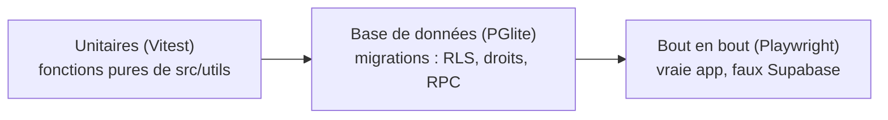

# 6. Outillage et exploitation

[← Parcours détaillés](05-parcours.md) · [Sommaire](README.md)

## 1. Scripts npm

| Commande | Rôle |
| --- | --- |
| `npm run dev` | Serveur de développement Vite (lit `.env` : `VITE_SUPABASE_URL`, `VITE_SUPABASE_ANON_KEY`) |
| `npm run build` / `npm run preview` | Build de production dans `dist/` / le servir localement |
| `npm test` | Tests unitaires Vitest (`src/**/*.test.js`) |
| `npm run test:db` | Tests des migrations dans PGlite (`supabase/tests/*.test.mjs`) |
| `npm run test:e2e` | Tests Playwright de bout en bout (ordinateur + Pixel 7) |
| `npm run populate:sets` / `populate:cards` / `populate:fr` / `populate:sync` | Import pokemontcg.io, et des cartes françaises depuis TCGdex (admin, clé service role) |

Node 22 (`.nvmrc`). Sur la machine de dev : `nvm use` (la version par
défaut est trop vieille) ; le réseau intercepte HTTPS, donc les scripts
Node se lancent avec `NODE_USE_SYSTEM_CA=1` et Playwright avec
`PW_CHANNEL=chrome` (il ne peut pas télécharger son navigateur).

---

## 2. Les trois niveaux de tests

### Unitaires — `npm test`

Chaque fichier de `src/utils/` a son `*.test.js` voisin : raretés,
statistiques, rangs, économie du Défi, règles du mini-jeu, succès (dont un
test qui échoue si une traduction EN/FR manque), etc. Toute nouvelle
logique pure va dans `src/utils/` avec ses tests.

### Base de données — `npm run test:db`

Il n'y a pas d'accès en ligne de commande au vrai projet Supabase. Les
migrations sont donc testées dans **PGlite** (Postgres compilé en
WebAssembly, sans serveur) :

- [supabase/tests/harness.mjs](../../supabase/tests/harness.mjs) simule ce
  que fournit Supabase : une table `auth.users`, `auth.uid()` lu dans
  `request.jwt.claim.sub`, les rôles `anon` / `authenticated` /
  `service_role`, la publication Realtime ;
- `freshDb('000N')` exécute les migrations 0001 à 000N, **la dernière deux
  fois** (elles doivent pouvoir être relancées) ;
- `helpers(db).as(userId)` change de rôle pour tester la RLS « en tant que »
  joueur ; `asAdmin()` pour lire les lignes des autres.
- PGlite n'a pas l'extension **pg-safeupdate** de Supabase, qui refuse via
  l'API tout `UPDATE` / `DELETE` sans `WHERE` (« UPDATE requires a WHERE
  clause », erreur 21000), même sur une table temporaire dans une fonction :
  `unsafeFunctions(db)` (et `unsafeWrites(sql)`) relit le corps de toutes
  les fonctions de `public` et liste ces requêtes ; la suite 0034 l'exige
  vide (le bug des combats contre les bots, vert en local, cassé en ligne).
- PGlite n'a pas de **JIT** : une requête que Postgres estime chère
  (fonction de coût 100 × des milliers de lignes) y reste rapide, mais en
  ligne Supabase la compile d'abord, ce qui peut coûter des secondes.
  `pvp_bot_deck('all', …)` : 0,4 s dans PGlite avec les vraies cartes,
  4,5 s en ligne (11 fois plus, contre 3 à 6 fois pour les petits
  formats). 0036 met `set jit = off` sur la fonction. Pour mesurer en
  ligne sans joueur : appeler la fonction interne en REST avec la clé
  service role et lire `time_total` de `curl` ; pour profiler en local
  sur les vraies cartes : les télécharger en REST (`/rest/v1/cards?select=*`,
  pages de 1 000) et les insérer dans PGlite avec
  `jsonb_populate_recordset` (un `EXPLAIN (ANALYZE, VERBOSE)` montre où
  part le temps).

Chaque migration depuis 0010 a sa suite (`supabase/tests/000N_*.test.mjs`)
qui vérifie la RLS, les droits et les RPC.

### Bout en bout — `npm run test:e2e`

[playwright.config.js](../../playwright.config.js) construit l'app dans
`dist-e2e/` en pointant vers un faux hôte `https://e2e.supabase.test`, puis
la sert sur le port 4174. **Tout Supabase est simulé** dans
[e2e/support/supabase.js](../../e2e/support/supabase.js) : `mockSupabase(page,
options)` intercepte chaque requête REST/RPC et répond à partir d'un état
en mémoire (collection, profil, portefeuille, échanges…) ; `signIn(page)`
pose une fausse session. Aucun secret, aucun réseau.

- Deux projets : **desktop** (Chrome) et **mobile** (Pixel 7, qui passe par
  les animations légères).
- Les tests forcent `prefers-reduced-motion` : effets décoratifs coupés.
- Tests transverses dans `navigation.spec.js` : aucune page ne défile
  horizontalement à la largeur d'un téléphone, aucune page n'écrit
  d'erreur dans la console, le mode reste visible partout, reprise après
  un déploiement.
- **Une fonctionnalité qui appelle un nouveau point d'accès doit l'ajouter
  au faux Supabase**, sinon la requête échoue dans les tests.
- Animations : utiliser `click({ force: true })` sur les éléments animés
  et attendre que le booster soit activé.

### Ce qui n'est pas testé automatiquement

Realtime (fil et échanges : pas de simulation de WebSocket) et tout ce qui
demande deux vrais comptes. Ces points sont couverts par la checklist
manuelle [docs/manual-testing.md](../manual-testing.md).

---

## 3. Import des cartes

[scripts/populate.mjs](../../scripts/populate.mjs), lancé à la main ou par
le workflow de synchro (minuit et midi). Il lit `scripts/.env.local` (non versionné) :
`SUPABASE_URL`, `SUPABASE_SERVICE_ROLE_KEY`, `POKEMONTCG_API_KEY`.

| Cible | Fait |
| --- | --- |
| `sets` | Pages de 250 sets → `upsert` dans `sets` (dont `logo_url`, `symbol_url` fournis par l'API) |
| `cards [page]` | Pages de 250 cartes → `upsert` dans `cards` (`value` = `cardPriceEur()` de `src/utils/cardPrice.js` : moyenne de vente Cardmarket, sinon prix TCGplayer × `USD_TO_EUR`, 0,86 par défaut — les sets récents comme Évolutions Prismatiques ou Méga-Évolution n'ont que TCGplayer) + un relevé du jour dans `card_price_history` ; puis `link_subsets()` |
| `fr [--rematch]` | Cartes françaises depuis TCGdex (0029, sans clé ; textes des Dresseurs depuis 0032) : 1. les sets pas encore reliés (`sets.tcgdex_id` null) sont comparés aux sets TCGdex (numéros + noms anglais, `matchSet` de `src/utils/tcgdex.js`, 60 % au moins) ; `''` = aucun (enregistré seulement si TCGdex a répondu pour tous les sets), `--rematch` les recherche à nouveau. 2. une requête par set relié : `sets.name_fr`, puis `name_fr` et `image_fr` de chaque carte (par numéro) via `set_cards_fr()`. 3. une requête par Pokémon dont `attacks_fr` est vide : noms et textes français des attaques et talents (6 à la fois). Mesuré le 2026-10-05 : 172 sets sur 176 reliés, 19 245 cartes sur 20 670 avec un nom et une image français ; la première passe fait ~17 000 requêtes (quelques minutes), les suivantes seulement les nouvelles cartes |
| `sync [page]` | `sets` puis `cards` puis `link_subsets()` puis `fr` |

Depuis 0029, `cards` stocke aussi le texte de chaque attaque et ce que les
combats PvP en jouent : `parseAttack()` de `src/utils/attackEffects.js`
lit le texte anglais (« Flip a coin. If heads, the Defending Pokémon is
now Paralyzed. ») et range des effets (`fx`) que le moteur SQL applique,
plus le coût de Retraite et les talents. Une colonne absente (migration
pas encore appliquée) est sautée (`OPTIONAL_COLUMNS`) ; l'étape `fr`
s'arrête avec un avertissement sans 0029. Sur cette machine, Node a
besoin de `NODE_USE_SYSTEM_CA=1` pour joindre TCGdex (réseau filtré).

Depuis 0031, chaque attaque garde aussi son coût typé (`energy` :
`['Fire', 'Colorless']`). Depuis 0032, chaque Dresseur a sa colonne
`trainer` (`trainerData()` de `src/utils/trainerEffects.js` : type, effets
`fx` lus dans le texte, pièce, `playable` = tout le texte est compris,
texte anglais, ACE SPEC), et l'étape `fr` va chercher le texte français des
Dresseurs (`effect_fr`, une requête par carte, une seule fois). Mesuré le
2026-10-05 : 578 Objets / Supporters / Outils sur 2 506 jouables (146 noms),
les classiques compris ; les textes qui parlent de cartes Énergie, de
Récompenses ou de Stades restent injouables. Depuis 0033, chaque talent
est stocké avec ce que les combats en jouent (`abilityData()` de
`src/utils/abilityEffects.js` : sorte, effets, jouable) : 489 sur 4 106.

L'API pokemontcg.io est capricieuse : chaque page est retentée 15 fois
(`API_ATTEMPTS`) avec un délai croissant (plafonné à 15 s, un peu de
hasard en plus), et une pause de 300 ms sépare les pages. Le 2026-10-06,
~60 % de ses réponses étaient des 500 / 502 instantanés : avec 6 essais,
une page sur 20 échouait à tous, donc presque chaque import en perdait
une. Le nombre de
pages vient du `totalCount` de l'API (`forEachPage`) : une page qui échoue
encore est sautée, retentée à la fin (`RETRY_ROUNDS` = 3 tours, 30 s
entre deux pages), et si elle échoue toujours
le script se termine en erreur (le workflow passe au rouge). Avant le
2026-10-04, une page en échec était prise pour la dernière : l'import
s'arrêtait là et le workflow restait vert (la synchro de minuit ce
jour-là n'avait importé qu'une partie des cartes). Le numéro de page
optionnel permet de reprendre un import interrompu.

**Workflow** [sync-cards.yml](../../.github/workflows/sync-cards.yml) :
tous les jours à minuit et à midi, heure de Paris (ou à la demande, avec
une page de départ), `populate.mjs sync` (environ 4 minutes). Le cron de
GitHub est en UTC : chaque passage a un créneau d'été (UTC+2) et un
d'hiver (UTC+1), et la première étape (« Paris time ») ne laisse passer
que celui qui correspond au décalage du jour. Minute 7 plutôt que 0 :
GitHub retarde surtout les tâches programmées à l'heure pile (le premier
passage du lundi, prévu à 04:00 UTC, n'a démarré qu'à 13:55), le départ
peut donc quand même avoir du retard. `concurrency` empêche un passage
manuel et un passage programmé d'écrire en même temps. Il faut trois
secrets de dépôt : `SUPABASE_URL`, `SUPABASE_SERVICE_ROLE_KEY`,
`POKEMONTCG_API_KEY`. Un relevé de prix par jour (celui de midi met à
jour celui de minuit) : deux jours d'import suffisent pour qu'une courbe
apparaisse.

**Données des succès régionaux** :
[scripts/region-tools.mjs](../../scripts/region-tools.mjs), outil de
développement (jamais dans le bundle), cache PokéAPI dans
`scripts/.cache/` (ignoré par git), `NODE_USE_SYSTEM_CA=1` sur cette
machine. `lines <de> <à>` : chaînes d'évolution ; `encounters <id de
région> <versions>` : Pokémon sauvages des premiers jeux par lieu
(herbe, surf, Super Canne, rencontres uniques, Pokémon visibles
d'Épée/Bouclier), formes comptées comme
leur espèce (Rattata d'Alola = n° 19), lieux identiques regroupés ; `cards <regex>` : noms de cartes de la base (clé service
role de `scripts/.env.local`) ; `texts <région>` : écrit les textes EN/FR
manquants des lignées, routes et lieux avec les noms officiels de
PokéAPI (une route peut porter sa région : `unovaRoute5and16`). Le reste
(arènes, dresseurs, séries) s'écrit à la main. `fr-names` : réécrit
`src/utils/pokemonNamesFr.js`, le nom français officiel de chaque Pokémon
(n° 1 à 1025 à ce jour), utilisé par la recherche de la collection ; à
relancer quand une génération sort.

---

## 4. Intégration continue et déploiement

**CI** ([ci.yml](../../.github/workflows/ci.yml)) : à chaque push sur
`main` et chaque pull request : `npm ci`, tests unitaires, tests base de
données, build, installation de Chromium, tests e2e. Le rapport Playwright
est conservé 7 jours en cas d'échec.

**Déploiement** : Vercel construit et sert l'app. Les variables `VITE_*`
sont définies dans Vercel.
[vercel.json](../../vercel.json) renvoie toutes les routes vers
`index.html` (SPA) **sauf `/assets/*`**, et sert `sw.js` sans cache. Les
onglets déjà ouverts passent au nouveau build tout seuls
([Parcours § 10](05-parcours.md#10-un-déploiement-pendant-quun-onglet-est-ouvert)).

**Réglages Supabase à faire dans le tableau de bord** : *Authentication >
URL Configuration*, ajouter `<site>/game` et `<site>/reset-password` aux
URL de redirection.

**Vérifier ce qui est appliqué sur le vrai projet** : des appels REST avec
la clé service role de `scripts/.env.local`. Une table absente répond 404 ;
une RPC existante appelée sans utilisateur répond `not_authenticated`.

---

## 5. Écrire une migration

Le schéma ne change **que** par un nouveau fichier
`supabase/migrations/000N_nom.sql`, exécuté à la main dans l'éditeur SQL
de Supabase.

1. **En-tête** : un commentaire qui explique ce que fait la migration,
   après laquelle la lancer, et si elle peut être relancée.
2. **Suivi en direct** : l'éditeur n'affiche que « running ». La migration
   commence donc par `set local lock_timeout = '15s';` (une attente de
   verrou échoue au lieu de bloquer) et chaque section par
   `set local application_name = 'migration 000N: step i/n …';`. On suit
   la progression depuis un autre onglet avec la requête de
   [manual-testing.md > Watching a migration run](../manual-testing.md#watching-a-migration-run).
3. **Relançable** : `create … if not exists`, `create or replace`,
   `drop policy if exists` avant `create policy`, blocs `do $$ … $$` qui
   vérifient l'état.
4. **Sécurité** : RLS activée sur chaque nouvelle table ; aucune règle
   d'écriture client sur une donnée de jeu. Les écritures passent par des
   fonctions `security definer` avec `set search_path = public, pg_temp`,
   qui ne touchent que `auth.uid()`, verrouillent le portefeuille si elles
   touchent aux pièces, et limitent leur fréquence si besoin. Retirer
   `execute` des fonctions internes à `public, anon, authenticated`.
5. **Suite de tests** `supabase/tests/000N_nom.test.mjs` (RLS, droits,
   RPC, double exécution) qui passe avec `npm run test:db`.
6. **Client tolérant** : tant que la migration n'est pas appliquée, le
   client doit continuer de marcher (repli sur `42703` / `PGRST202` /
   `PGRST205`).
7. **Mettre à jour** : le faux Supabase des tests e2e, cette doc
   ([Base de données](03-base-de-donnees.md) et
   [Référence API](04-reference-api.md)), `README.md`, `CLAUDE.md`.
8. La **confier à la personne qui a accès au projet** pour l'exécuter,
   puis vérifier qu'elle est appliquée.

---

## 6. Secrets et configuration

| Où | Contient | Exposé ? |
| --- | --- | --- |
| `.env` (dev) / variables Vercel | `VITE_SUPABASE_URL`, `VITE_SUPABASE_ANON_KEY` | Oui, dans le bundle, et c'est normal : la protection vient de la RLS |
| `scripts/.env.local` (non versionné) | URL, **clé service role**, clé pokemontcg.io | Jamais. Node uniquement, rien sous `src/` ne l'importe |
| Secrets GitHub | Les trois mêmes, pour le workflow de synchro | Jamais |

La clé pokemontcg.io actuelle apparaît dans l'historique git : il faudra
la changer si le dépôt devient public.
